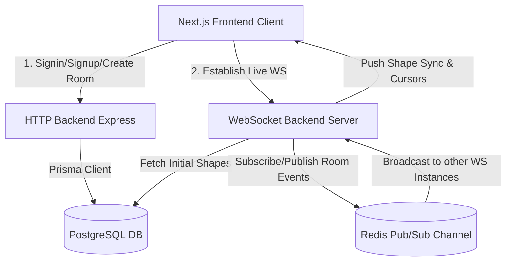

# DrawIt — The Complete Codebase Bible & Development Textbook

Welcome to the **DrawIt Codebase Textbook**. This document is designed to serve as an exhaustive, self-guided development guide and textbook for the DrawIt real-time collaborative whiteboard application. Whether you are studying this codebase to understand its architectural patterns or rewriting the application from scratch to build your skills as a strong full-stack engineer, this book will walk you through every concept, line of code, and design decision.

---

# Table of Contents
1. [Chapter 1: Tech Stack, System Architecture, & Features](#chapter-1-tech-stack-system-architecture--features)
2. [Chapter 2: Monorepo Tooling (pnpm & Turborepo)](#chapter-2-monorepo-tooling-pnpm--turborepo)
3. [Chapter 3: Shared Common Packages](#chapter-3-shared-common-packages)
4. [Chapter 4: The HTTP Backend (Express)](#chapter-4-the-http-backend-express)
5. [Chapter 5: The Real-Time WebSocket Server (ioredis & Pub/Sub)](#chapter-5-the-real-time-websocket-server-ioredis--pubsub)
6. [Chapter 6: The Frontend Application (Next.js, Canvas, & Zustand)](#chapter-6-the-frontend-application-nextjs-canvas--zustand)
7. [Chapter 7: How to Build & Run the Application](#chapter-7-how-to-build--run-the-application)

---

# Chapter 1: Tech Stack, System Architecture, & Features

Before diving into code, it is critical to understand the environment, tools, and visual requirements of DrawIt.

## 1. The Tech Stack
*   **Monorepo Structure:** Managed via **Turborepo** and **pnpm workspaces** for fast builds, task pipelining, and zero-redundancy dependency resolution.
*   **Language:** Pure **TypeScript** across both frontend and backend for absolute compile-time type safety.
*   **HTTP Backend:** **Node.js** with **Express.js** for database-backed REST APIs (authentication, room setup, history fetching).
*   **WebSocket Backend:** **Node.js** with the native `ws` library for low-latency, real-time message sync.
*   **Database & ORM:** **PostgreSQL** (hosted via Neon DB) as the primary store, coupled with **Prisma ORM** for schema definition and migrations.
*   **Real-time Scale Out:** **Redis** via `ioredis` to enable scale-out pub/sub between multiple WebSocket server instances.
*   **Frontend UI:** **Next.js 16 (App Router)** with **React 19** and **TailwindCSS v4**.
*   **State Management:** **Zustand** on the frontend for clean, non-render-blocking canvas state, camera parameters, and historical stacks (Undo/Redo).
*   **Drawing Engine:** Custom **HTML5 Canvas context wrapper** combined with **Rough.js** to generate organic, sketchy hand-drawn aesthetics.

## 2. Key Features
1.  **Collaborative Whiteboard Canvas:** Sketch rectangles, ellipses, straight lines, freehand pencil paths, and multiline text.
2.  **Peer Cursor Overlay:** Synchronize and render coordinate indicators for active cursors in real time, with automatic timeout deletion for inactive users.
3.  **Advanced Camera Matrix:** Zoom in/out via Ctrl+Scroll wheel (0.1x to 10x) and pan across infinite space using the Hand Tool or holding space.
4.  **Styling Customization:** HSL-tailored colors, dynamic border thickness slider, and custom sketch fill styles (Solid, Outline, and sketchy Hachure patterns).
5.  **History Engine:** Local Undo/Redo stacks triggered via UI buttons or system hotkeys (Ctrl+Z and Ctrl+Y).
6.  **Persistence & Auth:** JWT auth headers, schema validators (Zod), encrypted password hashing (`bcryptjs`), and database-driven room creation/deletion.
7.  **PNG Export:** Renders the combined whiteboard elements onto a memory buffer and downloads it as a PNG file.

## 3. System Architecture Diagram



---

# Chapter 2: Monorepo Tooling (pnpm & Turborepo)

A **monorepo** allows multiple applications and packages to live in a single repository while keeping dependencies and builds completely isolated. This avoids version mismatching and simplifies deployment.

### pnpm Workspaces
Rather than compiling packages and manually publishing them to NPM, `pnpm` links folders locally using symlinks. We specify directories in `pnpm-workspace.yaml`.

### Turborepo
Turborepo parses package graphs and caches outputs. If a file in `@repo/db` hasn't changed, Turborepo skips compiling it when building `http-backend`.

---

## Initialization Assignments

### Task 1: Initialize Workspace Directory and Manifest
Create the monorepo workspace directory, define global scripts, configure the target package manager (`pnpm@9.0.0`), and write the workspace mapping config.

#### Solution: Root `package.json`
```json
{
  "name": "draw-app",
  "private": true,
  "scripts": {
    "build": "turbo build",
    "dev": "turbo dev",
    "lint": "turbo lint",
    "format": "prettier --write \"**/*.{ts,tsx,md}\""
  },
  "devDependencies": {
    "prettier": "^3.2.5",
    "tsx": "^4.16.2",
    "turbo": "^2.3.3",
    "typescript": "5.5.4"
  },
  "packageManager": "pnpm@9.0.0",
  "engines": {
    "node": ">=18"
  }
}
```

#### Solution: Root `pnpm-workspace.yaml`
```yaml
packages:
  - "apps/*"
  - "packages/*"
```

#### Solution: Root `turbo.json`
```json
{
  "$schema": "https://turbo.build/schema.json",
  "ui": "tui",
  "tasks": {
    "build": {
      "dependsOn": ["^build"],
      "inputs": ["$TURBO_DEFAULT$", ".env*"]
    },
    "lint": {
      "dependsOn": ["^lint"]
    },
    "check-types": {
      "dependsOn": ["^check-types"]
    },
    "dev": {
      "cache": false,
      "persistent": true
    }
  }
}
```

---

# Chapter 3: Shared Common Packages

We configure shared logic inside the `packages/` folder. This keeps shared configuration DRY (Don't Repeat Yourself).

---

## Set of Tasks (Shared Configs & Types)

*   **Task 1:** Create base TypeScript compiler properties to share among backends and packages.
*   **Task 2:** Create a `@repo/common` package that defines validation schemas using Zod.
*   **Task 3:** Create a `@repo/backend-common` package that stores configuration details like JWT secrets.
*   **Task 4:** Create a `@repo/db` package that maps database tables to TypeScript classes via Prisma.

---

## Code Solutions

### Task 1: TypeScript Configuration Setup
We define compiler settings once in `packages/typescript-config/base.json` and extend them in other packages.

#### File: [base.json](file:///c:/Users/Abhishek/Documents/Projects/DrawIt/packages/typescript-config/base.json)
```json
{
  "$schema": "https://json.schemastore.org/tsconfig",
  "compilerOptions": {
    "baseUrl": ".",
    "declaration": true,
    "declarationMap": true,
    "esModuleInterop": true,
    "isolatedModules": true,
    "lib": ["es2022", "DOM", "DOM.Iterable"],
    "module": "NodeNext",
    "moduleDetection": "force",
    "moduleResolution": "NodeNext",
    "noUncheckedIndexedAccess": true,
    "resolveJsonModule": true,
    "skipLibCheck": true,
    "strict": true,
    "target": "ES2022"
  }
}
```

#### File: [package.json](file:///c:/Users/Abhishek/Documents/Projects/DrawIt/packages/typescript-config/package.json)
```json
{
  "name": "@repo/typescript-config",
  "version": "1.0.0",
  "private": true
}
```

---

### Task 2: Shared Zod Schema Package (`@repo/common`)
Rather than rewriting validator code for frontend and backend inputs, we bundle schema objects in a package called `@repo/common`.

#### File: [package.json](file:///c:/Users/Abhishek/Documents/Projects/DrawIt/packages/common/package.json)
```json
{
  "name": "@repo/common",
  "version": "1.0.0",
  "exports": {
    "./types": "./src/types.ts"
  },
  "main": "index.js",
  "scripts": {
    "test": "echo \"Error: no test specified\" && exit 1"
  },
  "devDependencies": {
    "@repo/typescript-config": "workspace:*"
  },
  "dependencies": {
    "zod": "^3.24.1"
  }
}
```

#### File: [tsconfig.json](file:///c:/Users/Abhishek/Documents/Projects/DrawIt/packages/common/tsconfig.json)
```json
{
  "extends": "@repo/typescript-config/base.json"
}
```

#### File: [types.ts](file:///c:/Users/Abhishek/Documents/Projects/DrawIt/packages/common/src/types.ts)
```typescript
import { z } from "zod";

// Validates parameters needed for new user signups
export const CreateUserSchema = z.object({
    username: z.string().min(3).max(40),
    password: z.string(),
    name: z.string()
});

// Validates parameters needed for user logins
export const SigninSchema = z.object({
    username: z.string().min(3).max(40),
    password: z.string(),
});

// Validates parameters needed for room creation
export const CreateRoomSchema = z.object({
    name: z.string().min(3).max(20),
});
```

---

### Task 3: Backend Configurations (`@repo/backend-common`)
Configures settings shared strictly by server nodes (e.g., JWT signing secrets).

#### File: [package.json](file:///c:/Users/Abhishek/Documents/Projects/DrawIt/packages/backend-common/package.json)
```json
{
  "name": "@repo/backend-common",
  "version": "1.0.0",
  "main": "index.js",
  "exports": {
    "./config": "./src/index.ts"
  },
  "devDependencies": {
    "@repo/typescript-config": "workspace:*"
  },
  "dependencies": {
    "@types/node": "^22.10.5"
  }
}
```

#### File: [tsconfig.json](file:///c:/Users/Abhishek/Documents/Projects/DrawIt/packages/backend-common/tsconfig.json)
```json
{
  "extends": "@repo/typescript-config/base.json"
}
```

#### File: [index.ts](file:///c:/Users/Abhishek/Documents/Projects/DrawIt/packages/backend-common/src/index.ts)
```typescript
// Exports a fallback JWT secret. Prioritizes the environment variable if present.
export const JWT_SECRET = process.env.JWT_SECRET || "123123";
```

---

### Task 4: Database Model Mapping (`@repo/db`)
Prisma translates logical SQL databases into structured JavaScript objects. Below is our schema mapping.

#### File: [package.json](file:///c:/Users/Abhishek/Documents/Projects/DrawIt/packages/db/package.json)
```json
{
  "name": "@repo/db",
  "version": "1.0.0",
  "main": "./dist/index.js",
  "types": "./dist/index.d.ts",
  "exports": {
    ".": "./dist/index.js"
  },
  "scripts": {
    "build": "tsc"
  },
  "devDependencies": {
    "@repo/typescript-config": "workspace:*",
    "prisma": "^6.2.1"
  },
  "dependencies": {
    "@prisma/client": "6.2.1"
  }
}
```

#### File: [tsconfig.json](file:///c:/Users/Abhishek/Documents/Projects/DrawIt/packages/db/tsconfig.json)
```json
{
    "extends": "@repo/typescript-config/base.json",
    "compilerOptions": {
        "composite": true,
        "rootDir": "./src",
        "outDir": "./dist"
    }
}
```

#### File: [schema.prisma](file:///c:/Users/Abhishek/Documents/Projects/DrawIt/packages/db/prisma/schema.prisma)
```prisma
generator client {
  provider = "prisma-client-js"
}

datasource db {
  provider = "postgresql"
  url      = env("DATABASE_URL")
}

model User {
  id            String     @id @default(uuid())
  email         String     @unique
  password      String
  name          String
  photo         String?
  rooms         Room[]
  chats         Chat[]
  shapes        Shape[]
}

model Room {
  id          Int       @id @default(autoincrement())
  slug        String    @unique
  createdAt   DateTime  @default(now())
  adminId     String
  admin       User      @relation(fields: [adminId], references: [id])
  chats       Chat[]
  shapes      Shape[]
}

model Chat {
  id        Int       @id  @default(autoincrement())
  roomId    Int
  message   String
  userId    String
  room      Room      @relation(fields: [roomId], references: [id])
  user      User      @relation(fields: [userId], references: [id])
}

model Shape {
  id        Int       @id @default(autoincrement())
  roomId    Int
  message   String
  userId    String
  room      Room      @relation(fields: [roomId], references: [id])
  user      User      @relation(fields: [userId], references: [id])
}
```

#### File: [index.ts](file:///c:/Users/Abhishek/Documents/Projects/DrawIt/packages/db/src/index.ts)
```typescript
import { PrismaClient } from "@prisma/client";

// Instantiates a globally shared client to connect to Neon PostgreSQL database.
export const prismaClient = new PrismaClient();
```

---

# Chapter 4: The HTTP Backend (Express)

The HTTP backend handles RESTful actions that do not require low-latency streams: authentication, room dashboard listings, details queries, and canvas-clearing sweeps.

---

## Set of Tasks (HTTP API Architecture)

*   **Task 1:** Boot up an Express app in TypeScript, configure JSON body parser and CORS permissions.
*   **Task 2:** Write custom authentication middleware to check incoming JWT headers.
*   **Task 3:** Write secure Signup (`/signup`) and Signin (`/signin`) endpoints with password hashing using `bcryptjs`.
*   **Task 4:** Write Room management endpoints (create `/room`, fetch slug `/room/:slug`, list `/rooms`, rename `PUT /room/:roomId`, and delete `/room/:roomId`).

---

## Code Solutions

### Task 1 & 2: Base Config & Authentication Middleware
The middleware intercepts request routes, extracts the `Authorization` header, decodes the signed token, and extracts the `userId` payload.

#### File: [package.json](file:///c:/Users/Abhishek/Documents/Projects/DrawIt/apps/http-backend/package.json)
```json
{
  "name": "http-backend",
  "version": "1.0.0",
  "main": "index.js",
  "scripts": {
    "build": "tsc -b",
    "start": "node ./dist/index.js",
    "dev": "tsx watch src/index.ts"
  },
  "dependencies": {
    "@repo/db": "workspace:*",
    "@types/cors": "^2.8.17",
    "@types/jsonwebtoken": "^9.0.7",
    "bcryptjs": "^3.0.3",
    "cors": "^2.8.5",
    "express": "^4.21.2",
    "jsonwebtoken": "^9.0.2"
  },
  "devDependencies": {
    "@repo/backend-common": "workspace:*",
    "@repo/common": "workspace:*",
    "@repo/typescript-config": "workspace:*",
    "@types/bcryptjs": "^3.0.0",
    "@types/express": "^5.0.0"
  }
}
```

#### File: [tsconfig.json](file:///c:/Users/Abhishek/Documents/Projects/DrawIt/apps/http-backend/tsconfig.json)
```json
{
    "extends": "@repo/typescript-config/base.json",
    "compilerOptions": {
        "rootDir": "./src",
        "outDir": "./dist"
    },
    "references": [
        { "path": "../../packages/db" }
    ]
}
```

#### File: [middleware.ts](file:///c:/Users/Abhishek/Documents/Projects/DrawIt/apps/http-backend/src/middleware.ts)
```typescript
import { NextFunction, Request, Response } from "express";
import jwt from "jsonwebtoken";
import { JWT_SECRET } from "@repo/backend-common/config";

export function middleware(req: Request, res: Response, next: NextFunction) {
    // Read the authorization token from request headers
    const token = req.headers["authorization"] ?? "";

    try {
        // Verify token signatures using our shared JWT Secret key
        const decoded = jwt.verify(token, JWT_SECRET);

        if (decoded && typeof decoded !== "string") {
            // Attach the decoded userId to the Request object for use in downstream routes
            // @ts-ignore
            req.userId = decoded.userId;
            next();
        } else {
            res.status(403).json({
                message: "Unauthorized"
            });
        }
    } catch (e) {
        res.status(403).json({
            message: "Unauthorized"
        });
    }
}
```

---

### Task 3 & 4: API Endpoints Controller (`index.ts`)
This file handles authentication, room settings updates, canvas clears, and history requests.

#### File: [index.ts](file:///c:/Users/Abhishek/Documents/Projects/DrawIt/apps/http-backend/src/index.ts)
```typescript
import express from "express";
import jwt from "jsonwebtoken";
import bcrypt from "bcryptjs";
import { JWT_SECRET } from '@repo/backend-common/config';
import { middleware } from "./middleware";
import { CreateUserSchema, SigninSchema, CreateRoomSchema } from "@repo/common/types";
import { prismaClient } from "@repo/db";
import cors from "cors";

const app = express();
app.use(express.json());
app.use(cors());

// USER SIGNUP
app.post("/signup", async (req, res) => {
    // Validate request body schemas via Zod
    const parsedData = CreateUserSchema.safeParse(req.body);
    if (!parsedData.success) {
        console.log(parsedData.error);
        res.json({ message: "Incorrect inputs" });
        return;
    }
    try {
        // Hash passwords using bcrypt before saving to the database
        const hashedPassword = await bcrypt.hash(parsedData.data.password, 10);
        const user = await prismaClient.user.create({
            data: {
                email: parsedData.data?.username,
                password: hashedPassword,
                name: parsedData.data.name
            }
        });
        res.json({ userId: user.id });
    } catch(e) {
        console.error("Signup error details:", e);
        res.status(411).json({
            message: "User already exists with this email"
        });
    }
});

// USER SIGNIN
app.post("/signin", async (req, res) => {
    const parsedData = SigninSchema.safeParse(req.body);
    if (!parsedData.success) {
        res.json({ message: "Incorrect inputs" });
        return;
    }

    try {
        const user = await prismaClient.user.findFirst({
            where: { email: parsedData.data.username }
        });

        if (!user) {
            res.status(403).json({ message: "Not authorized" });
            return;
        }

        // Verify password inputs against database hash
        const isValidPassword = await bcrypt.compare(parsedData.data.password, user.password);
        if (!isValidPassword) {
            res.status(403).json({ message: "Not authorized" });
            return;
        }

        // Generate JWT token containing authenticated User ID
        const token = jwt.sign({ userId: user?.id }, JWT_SECRET);

        res.json({ token });
    } catch(e) {
        console.error("Signin error:", e);
        res.status(500).json({
            message: "Internal server error"
        });
    }
});

// CREATE ROOM
app.post("/room", middleware, async (req, res) => {
    const parsedData = CreateRoomSchema.safeParse(req.body);
    if (!parsedData.success) {
        res.json({ message: "Incorrect inputs" });
        return;
    }
    // @ts-ignore
    const userId = req.userId;

    try {
        const normalizedSlug = parsedData.data.name.trim().toLowerCase().replace(/\s+/g, "-");
        const room = await prismaClient.room.create({
            data: {
                slug: normalizedSlug,
                adminId: userId
            }
        });

        res.json({ roomId: room.id });
    } catch(e) {
        console.error("Room creation error:", e);
        res.status(411).json({
            message: "Room already exists with this name"
        });
    }
});

// GET ROOM CHATS/SHAPES HISTORY
app.get("/chats/:roomId", async (req, res) => {
    try {
        const roomId = Number(req.params.roomId);
        // We query Shape model contents which stores serialized sketchy canvas data
        const messages = await prismaClient.shape.findMany({
            where: { roomId: roomId }
        });

        res.json({ messages });
    } catch(e) {
        console.log(e);
        res.json({ messages: [] });
    }
});

// CLEAR CANVAS (DELETES ROOM SHAPES)
app.delete("/chats/:roomId", middleware, async (req, res) => {
    try {
        const roomId = Number(req.params.roomId);
        // @ts-ignore
        const userId = req.userId;

        // Fetch room to confirm requesting user is the creator (admin)
        const room = await prismaClient.room.findFirst({
            where: { id: roomId }
        });

        if (!room) {
            res.status(404).json({ message: "Room not found" });
            return;
        }

        if (room.adminId !== userId) {
            res.status(403).json({ message: "Only the room creator can clear the canvas" });
            return;
        }

        // Delete all shapes associated with the room id
        await prismaClient.shape.deleteMany({
            where: { roomId: roomId }
        });
        res.json({ message: "Canvas cleared successfully" });
    } catch(e) {
        console.log(e);
        res.status(500).json({ message: "Failed to clear canvas" });
    }
});

// GET ROOM BY SLUG/NAME
app.get("/room/:slug", async (req, res) => {
    try {
        const slug = req.params.slug.trim().toLowerCase().replace(/\s+/g, "-");
        const room = await prismaClient.room.findFirst({
            where: { slug }
        });

        res.json({ room });
    } catch(e) {
        console.error("Error fetching room slug:", e);
        res.status(500).json({
            message: "Failed to load room details"
        });
    }
});

// GET CURRENT USER PROFILE
app.get("/user/me", middleware, async (req, res) => {
    try {
        // @ts-ignore
        const userId = req.userId;
        const user = await prismaClient.user.findUnique({
            where: { id: userId },
            select: { id: true, email: true, name: true }
        });

        if (!user) {
            res.status(404).json({ message: "User not found" });
            return;
        }

        res.json({ user });
    } catch(e) {
        res.status(500).json({ message: "Internal server error" });
    }
});

// RENAME ROOM
app.put("/room/:roomId", middleware, async (req, res) => {
    try {
        const roomId = Number(req.params.roomId);
        // @ts-ignore
        const userId = req.userId;
        const { name } = req.body;

        if (!name || name.trim().length < 3) {
            res.status(400).json({ message: "Room name must be at least 3 characters" });
            return;
        }

        const room = await prismaClient.room.findFirst({
            where: { id: roomId }
        });

        if (!room) {
            res.status(404).json({ message: "Room not found" });
            return;
        }

        if (room.adminId !== userId) {
            res.status(403).json({ message: "Only the room creator can rename it" });
            return;
        }

        // Convert the string to a valid URL slug format
        const slugifiedName = name.trim().toLowerCase().replace(/\s+/g, "-");

        const updatedRoom = await prismaClient.room.update({
            where: { id: roomId },
            data: { slug: slugifiedName }
        });

        res.json({
            message: "Room renamed successfully",
            room: updatedRoom
        });
    } catch (e) {
        console.error("Error renaming room:", e);
        res.status(411).json({ message: "Room name already exists" });
    }
});

// DELETE ROOM PERMANENTLY
app.delete("/room/:roomId", middleware, async (req, res) => {
    try {
        const roomId = Number(req.params.roomId);
        // @ts-ignore
        const userId = req.userId;

        const room = await prismaClient.room.findFirst({
            where: { id: roomId }
        });

        if (!room) {
            res.status(404).json({ message: "Room not found" });
            return;
        }

        if (room.adminId !== userId) {
            res.status(403).json({ message: "Only the room creator can delete the room" });
            return;
        }

        // Clean up linked dependencies (foreign keys) to prevent errors
        await prismaClient.shape.deleteMany({ where: { roomId } });
        await prismaClient.chat.deleteMany({ where: { roomId } });
        
        await prismaClient.room.delete({ where: { id: roomId } });

        res.json({ message: "Room deleted permanently" });
    } catch (e) {
        console.error("Error deleting room:", e);
        res.status(500).json({ message: "Failed to delete room" });
    }
});

// LIST USER'S CREATED ROOMS
app.get("/rooms", middleware, async (req, res) => {
    try {
        // @ts-ignore
        const userId = req.userId;
        const rooms = await prismaClient.room.findMany({
            where: { adminId: userId },
            orderBy: { createdAt: "desc" }
        });

        res.json({ rooms });
    } catch (e) {
        console.error("Error fetching rooms:", e);
        res.status(500).json({ message: "Failed to fetch rooms" });
    }
});

app.listen(3001, () => {
    console.log("HTTP Backend running on port 3001");
});
```

---

# Chapter 5: The Real-Time WebSocket Server (ioredis & Pub/Sub)

The WebSocket server provides real-time updates for peer cursor movements, shape placements, background shifts, and deletions.

### Redis Pub/Sub for Scaling
If we run multiple WebSocket servers behind a load balancer, clients on Server A won't receive messages from clients on Server B. 

To solve this, servers publish messages to a Redis channel named `room:<roomId>`. All server instances subscribe to this channel, receive the message, and broadcast it to their local connected clients in that room.

---

## Set of Tasks (WebSocket & Redis Synchronization)

*   **Task 1:** Set up dependencies (`ws`, `ioredis`, `dotenv`, `@repo/db`), read port configs, and handle connection authorization query parameters.
*   **Task 2:** Initialize two Redis clients: `pub` (publisher) and `sub` (subscriber).
*   **Task 3:** Implement channel subscription and cleanup. When a client joins a room, subscribe the server to `room:<id>`. Unsubscribe when the room becomes empty.
*   **Task 4:** Write handlers for WS message payloads: `ping`, `join_room`, `leave_room`, `cursor_move`, `chat` (syncing shape updates), `delete_shape`, and `clear_canvas`.

---

## Code Solutions

### Task 1 to 4: The WebSocket Server Loop
The WebSocket server validates incoming tokens, manages active room states, and handles Redis synchronization.

#### File: [package.json](file:///c:/Users/Abhishek/Documents/Projects/DrawIt/apps/ws-backend/package.json)
```json
{
  "name": "ws-backend",
  "version": "1.0.0",
  "main": "index.js",
  "scripts": {
    "build": "tsc -b",
    "start": "node ./dist/index.js",
    "dev": "tsx watch src/index.ts"
  },
  "dependencies": {
    "@repo/db": "workspace:*",
    "@types/jsonwebtoken": "^9.0.7",
    "dotenv": "^17.4.2",
    "ioredis": "^5.11.1",
    "jsonwebtoken": "^9.0.2",
    "ws": "^8.18.0"
  },
  "devDependencies": {
    "@repo/backend-common": "workspace:*",
    "@repo/typescript-config": "workspace:*",
    "@types/ioredis": "^5.0.0",
    "@types/ws": "^8.5.13"
  }
}
```

#### File: [tsconfig.json](file:///c:/Users/Abhishek/Documents/Projects/DrawIt/apps/ws-backend/tsconfig.json)
```json
{
    "extends": "@repo/typescript-config/base.json",
    "compilerOptions": {
        "rootDir": "./src",
        "outDir": "./dist"
    },
    "references": [
        { "path": "../../packages/db" }
    ]
}
```

#### File: [index.ts](file:///c:/Users/Abhishek/Documents/Projects/DrawIt/apps/ws-backend/src/index.ts)
```typescript
import { WebSocket, WebSocketServer } from 'ws';
import jwt from "jsonwebtoken";
import { JWT_SECRET } from '@repo/backend-common/config';
import { prismaClient } from "@repo/db";
import Redis from "ioredis";
dotenv.config();

process.on("unhandledRejection", (reason, promise) => {
    console.error("Unhandled Rejection at:", promise, "reason:", reason);
});

process.on("uncaughtException", (err) => {
    console.error("Uncaught Exception thrown:", err);
});

// Ensure the Redis connection string is present in environment variables
const REDIS_URL = process.env.REDIS_URL!;
const pub = new Redis(REDIS_URL);
const sub = new Redis(REDIS_URL);

// Instantiates a WebSocket server listening on port 8080
const wss = new WebSocketServer({ port: 8080 });

interface User {
  ws: WebSocket;
  rooms: string[];
  userId: string;
}

// Global state array containing current active connections on this local server instance
const users: User[] = [];

// Decodes and validates JWT authentication tokens passed via WebSocket handshake
function checkUser(token: string): string | null {
  try {
    const decoded = jwt.verify(token, JWT_SECRET);
    if (typeof decoded === "string") return null;
    if (!decoded || !decoded.userId) return null;
    return decoded.userId;
  } catch {
    return null;
  }
}

// REDIS SUBSCRIBE TRIGGER - Receives message events from Redis channels and broadcasts them to local clients
sub.on("message", (channel, message) => {
  const roomId = channel.replace("room:", "");
  users.forEach((user) => {
    // If the local user is subscribed to the message's room, forward it to their browser
    if (
      user.rooms.includes(roomId) &&
      user.ws.readyState === WebSocket.OPEN
    ) {
      user.ws.send(message);
    }
  });
});

wss.on("connection", function connection(ws, request) {
  const url = request.url;
  if (!url) return;

  // Extract authentication token from search query parameters: ws://localhost:8080?token=...
  const queryParams = new URLSearchParams(url.split("?")[1]);
  const token = queryParams.get("token") || "";
  const userId = checkUser(token);

  if (userId == null) {
    ws.close();
    return;
  }

  // Push new active user object to memory store
  users.push({ userId, rooms: [], ws });

  ws.on("message", async function message(data) {
    let parsedData;
    try {
      if (typeof data !== "string") {
        parsedData = JSON.parse(data.toString());
      } else {
        parsedData = JSON.parse(data);
      }
    } catch (e) {
      console.error("Failed to parse incoming WebSocket message:", e);
      return;
    }

    // 1. HEARTBEAT / PING PONG
    if (parsedData.type === "ping") {
      ws.send(JSON.stringify({ type: "pong" }));
      return;
    }

    // 2. JOIN ROOM
    if (parsedData.type === "join_room") {
      const user = users.find((x) => x.ws === ws);
      if (!user) return;
      const roomIdStr = String(parsedData.roomId);
      if (!user.rooms.includes(roomIdStr)) {
        user.rooms.push(roomIdStr);
      }
      // Instruct Redis to subscribe to the channel for this room ID
      await sub.subscribe(`room:${roomIdStr}`);
      return;
    }

    // 3. LEAVE ROOM
    if (parsedData.type === "leave_room") {
      const user = users.find((x) => x.ws === ws);
      if (!user) return;
      const roomIdStr = String(parsedData.roomId);
      user.rooms = user.rooms.filter((x) => x !== roomIdStr);
      
      // Notify other room members about this departure
      pub.publish(
        `room:${roomIdStr}`,
        JSON.stringify({
          type: "user_left",
          roomId: roomIdStr,
          userId,
        })
      );
      
      // If no users on this server instance remain in the room, unsubscribe from its Redis channel
      const hasUsers = users.some((u) => u.rooms.includes(roomIdStr));
      if (!hasUsers) {
        await sub.unsubscribe(`room:${roomIdStr}`);
      }
      return;
    }

    // 4. MOUSE CURSOR MOVE EVENT
    if (parsedData.type === "cursor_move") {
      const { roomId, x, y, name, color } = parsedData;
      pub.publish(
        `room:${roomId}`,
        JSON.stringify({
          type: "cursor_move",
          roomId,
          userId,
          x,
          y,
          name,
          color,
        })
      );
      return;
    }

    // 5. CANVAS BACKGROUND preset color change
    if (parsedData.type === "background_change") {
      const { roomId, color } = parsedData;
      pub.publish(
        `room:${roomId}`,
        JSON.stringify({ type: "background_change", roomId, color })
      );
      return;
    }

    // 6. DELETE SINGLE SHAPE (ERASER action)
    if (parsedData.type === "delete_shape") {
      const { roomId, shapeId } = parsedData;
      try {
        // Find and delete the shape matching both room and serialized JSON ID
        await prismaClient.shape.deleteMany({
          where: {
            roomId: Number(roomId),
            message: { contains: `"id":"${shapeId}"` },
          },
        });
        // Notify other clients in the room to delete the shape locally
        pub.publish(
          `room:${roomId}`,
          JSON.stringify({ type: "delete_shape", roomId, shapeId })
        );
      } catch (e) {
        console.error("Failed to delete shape from DB:", e);
      }
      return;
    }

    // 7. CLEAR ALL CANVAS ELEMENTS (admin action)
    if (parsedData.type === "clear_canvas") {
      const { roomId } = parsedData;
      try {
        const room = await prismaClient.room.findFirst({
          where: { id: Number(roomId) }
        });
        if (room && room.adminId === userId) {
          await prismaClient.shape.deleteMany({
            where: { roomId: Number(roomId) },
          });
          pub.publish(
            `room:${roomId}`,
            JSON.stringify({ type: "clear_canvas", roomId })
          );
        }
      } catch (e) {
        console.error("Failed to clear canvas from DB:", e);
      }
      return;
    }

    // 8. SHAPE SYNC / DRAW / UPDATE ACTION
    if (parsedData.type === "chat") {
      const { roomId, message } = parsedData;

      let shapeId = "";
      try {
        const parsed = JSON.parse(message);
        shapeId = parsed.id;
      } catch (e) {
        console.error("Failed to parse shape JSON:", e);
      }

      try {
        if (shapeId) {
          // Query database to see if shape already exists (e.g. if the user is moving/resizing it)
          const existing = await prismaClient.shape.findFirst({
            where: {
              roomId: Number(roomId),
              message: { contains: `"id":"${shapeId}"` },
            },
          });

          if (existing) {
            // If shape exists, update its values
            await prismaClient.shape.update({
              where: { id: existing.id },
              data: { message },
            });
          } else {
            // If it's a new shape, insert it into the database
            await prismaClient.shape.create({
              data: { roomId: Number(roomId), message, userId },
            });
          }
        } else {
          await prismaClient.shape.create({
            data: { roomId: Number(roomId), message, userId },
          });
        }
      } catch (e) {
        console.error("Failed to persist shape to DB:", e);
      }

      // Publish the drawing update to Redis to sync all active users in the room
      try {
        pub.publish(
          `room:${roomId}`,
          JSON.stringify({ type: "chat", message, roomId })
        );
      } catch (e) {
        console.error("Failed to publish shape message to Redis:", e);
      }
      return;
    }
  });

  // DISCONNECT EVENT
  ws.on("close", function () {
    const userIndex = users.findIndex((x) => x.ws === ws);
    if (userIndex === -1) return;
    const user = users[userIndex];
    if (!user) return;
    users.splice(userIndex, 1);

    // Leave all rooms the user was connected to
    user.rooms.forEach(async (roomId) => {
      const roomIdStr = String(roomId);
      pub.publish(
        `room:${roomIdStr}`,
        JSON.stringify({ type: "user_left", roomId: roomIdStr, userId: user.userId })
      );

      const hasUsers = users.some((u) => u.rooms.includes(roomIdStr));
      if (!hasUsers) {
        await sub.unsubscribe(`room:${roomIdStr}`);
      }
    });
  });
});

console.log("WS server running on port 8080");
```

---

# Chapter 6: The Frontend Application (Next.js, Canvas, & Zustand)

The frontend coordinates user input calculations, manages global state, and renders elements onto the HTML5 Canvas.

---

## Set of Tasks (Next.js & Frontend Elements)

*   **Task 1:** Set up configurations: global CSS tokens, font loaders, Layout wrappers, and Axios client interceptors.
*   **Task 2:** Write authentication logic and the custom real-time hooks: `useAuth.ts` and `useWebSocket.ts`.
*   **Task 3:** Create the Zustand State Store (`canvasStore.ts`) to manage shapes, camera zoom/pan states, current tool settings, and historical undo/redo stacks.
*   **Task 4:** Create the custom hook `useDrawing.tsx` to handle raw mouse pointer offsets, panning coordinates, selection boundary boxes, resize logic, and Rough.js vector drawing calculations.
*   **Task 5:** Write page views: landing/hero screen, User authentication (Signup/Signin) flows, dashboard room panel, and the collaborative whiteboard canvas container.

---

## Code Solutions

### Task 1: Environment and Styles Setup
Define tokens (backgrounds, surfaces, borders, font weights) in Tailwind configuration.

#### File: [package.json](file:///c:/Users/Abhishek/Documents/Projects/DrawIt/apps/frontend/package.json)
```json
{
  "name": "frontend",
  "version": "0.1.0",
  "private": true,
  "scripts": {
    "dev": "next dev",
    "build": "next build",
    "start": "next start",
    "lint": "eslint"
  },
  "dependencies": {
    "@base-ui/react": "^1.5.0",
    "axios": "^1.17.0",
    "class-variance-authority": "^0.7.1",
    "clsx": "^2.1.1",
    "next": "16.2.7",
    "react": "19.2.4",
    "react-dom": "19.2.4",
    "react-hot-toast": "^2.6.0",
    "roughjs": "^4.6.6",
    "tailwind-merge": "^3.6.0",
    "zustand": "^5.0.14"
  },
  "devDependencies": {
    "@tailwindcss/postcss": "^4",
    "@types/node": "^20",
    "@types/react": "^19",
    "@types/react-dom": "^19",
    "eslint": "^9",
    "eslint-config-next": "16.2.7",
    "tailwindcss": "^4",
    "typescript": "^5"
  }
}
```

#### File: [globals.css](file:///c:/Users/Abhishek/Documents/Projects/DrawIt/apps/frontend/app/globals.css)
```css
@import "tailwindcss";

@theme {
  --font-sans: var(--font-geist-sans), 'Geist Fallback';
  
  --color-background: var(--background);
  --color-foreground: var(--foreground);
  
  --color-card: var(--card);
  --color-card-foreground: var(--card-foreground);
  
  --color-popover: var(--popover);
  --color-popover-foreground: var(--popover-foreground);
  
  --color-primary: var(--primary);
  --color-primary-foreground: var(--primary-foreground);
  
  --color-secondary: var(--secondary);
  --color-secondary-foreground: var(--secondary-foreground);
  
  --color-muted: var(--muted);
  --color-muted-foreground: var(--muted-foreground);
  
  --color-accent: var(--accent);
  --color-accent-foreground: var(--accent-foreground);
  
  --color-destructive: var(--destructive);
  --color-destructive-foreground: var(--destructive-foreground);
  
  --color-border: var(--border);
  --color-input: var(--input);
  --color-ring: var(--ring);
  
  --radius-lg: var(--radius);
  --radius-md: calc(var(--radius) - 2px);
  --radius-sm: calc(var(--radius) - 4px);
}

:root {
  /* Warm earthy color tokens */
  --background: #fefae0;
  --foreground: #780000;

  --card: #faedcd;
  --card-foreground: #780000;

  --popover: #faedcd;
  --popover-foreground: #780000;

  --primary: #d4a373;
  --primary-foreground: #780000;

  --secondary: #faedcd;
  --secondary-foreground: #780000;

  --muted: #faedcd;
  --muted-foreground: #bc6c25;

  --accent: #d4a373;
  --accent-hover: #c1121f;
  --accent-foreground: #780000;

  --destructive: #c1121f;
  --destructive-foreground: #fefae0;

  --border: #ccd5ae;
  --input: #faedcd;
  --ring: #d4a373;

  --radius: 0.5rem;

  --bg: #fefae0;
  --surface: #faedcd;
  --text-primary: #780000;
  --text-secondary: #bc6c25;
  --accent: #d4a373;
  --accent-hover: #c1121f;
  --danger: #c1121f;
}

@layer base {
  * {
    @apply border-border;
    box-sizing: border-box;
    margin: 0;
    padding: 0;
  }
  body {
    @apply bg-background text-foreground;
    -webkit-font-smoothing: antialiased;
  }
}

::selection {
  background: var(--primary);
  color: white;
}

::-webkit-scrollbar { width: 6px; }
::-webkit-scrollbar-track { background: var(--background); }
::-webkit-scrollbar-thumb { background: var(--border); border-radius: 3px; }

input:-webkit-autofill,
input:-webkit-autofill:hover, 
input:-webkit-autofill:focus, 
input:-webkit-autofill:active {
  -webkit-box-shadow: 0 0 0 1000px #faedcd inset !important;
  -webkit-text-fill-color: #780000 !important;
  transition: background-color 5000s ease-in-out 0s;
}
```

#### File: [layout.tsx](file:///c:/Users/Abhishek/Documents/Projects/DrawIt/apps/frontend/app/layout.tsx)
```typescript
import type { Metadata } from "next";
import { Geist } from "next/font/google";
import { Toaster } from "react-hot-toast";
import "./globals.css";

const geist = Geist({ subsets: ["latin"] });

export const metadata: Metadata = {
  title: "DrawIt — Collaborative Whiteboard",
  description: "Real-time collaborative drawing. Sketch, diagram, and design together.",
};

export default function RootLayout({
  children,
}: {
  children: React.ReactNode;
}) {
  return (
    <html lang="en" className={geist.className} suppressHydrationWarning>
      <body suppressHydrationWarning>
        {children}
        <Toaster
          position="bottom-right"
          toastOptions={{
            style: {
              background: "#111111",
              color: "#ededed",
              border: "1px solid #222222",
              borderRadius: "8px",
              fontSize: "14px",
            },
          }}
        />
      </body>
    </html>
  );
}
```

#### File: [api.ts](file:///c:/Users/Abhishek/Documents/Projects/DrawIt/apps/frontend/lib/api.ts)
```typescript
import axios from "axios";

export const api = axios.create({
  baseURL: process.env.NEXT_PUBLIC_HTTP_URL ?? "http://localhost:3001",
});

// Axios Interceptor: Automatically appends the local JWT token to the Authorization header
api.interceptors.request.use((config) => {
  if (typeof window !== "undefined") {
    const token = localStorage.getItem("token");
    if (token) {
      config.headers.Authorization = token;
    }
  }
  return config;
});
```

---

### Task 2: Authentication & WebSocket Client Wrappers
`wsClient.ts` manages connection handshakes, buffers messages if the socket disconnected, pings the server to keep the connection alive, and triggers reconnection backoffs.

#### File: [useAuth.ts](file:///c:/Users/Abhishek/Documents/Projects/DrawIt/apps/frontend/hooks/useAuth.ts)
```typescript
export function useAuth() {
  const getToken = () => {
    if (typeof window === "undefined") return null;
    return localStorage.getItem("token");
  };

  const setToken = (token: string) => {
    localStorage.setItem("token", token);
  };

  const clearToken = () => {
    localStorage.removeItem("token");
  };

  const isLoggedIn = () => !!getToken();

  // Decodes client-side JWT token payloads to read the logged-in User ID
  const getUserId = () => {
    const token = getToken();
    if (!token) return null;
    try {
      const payload = token.split(".")[1];
      const decoded = JSON.parse(atob(payload!));
      return decoded.userId || null;
    } catch {
      return null;
    }
  };

  return { getToken, setToken, clearToken, isLoggedIn, getUserId };
}
```

#### File: [wsClient.ts](file:///c:/Users/Abhishek/Documents/Projects/DrawIt/apps/frontend/lib/wsClient.ts)
```typescript
type MessageHandler = (data: any) => void;

export class WSClient {
  private ws: WebSocket | null = null;
  private url: string;
  private token: string;
  private roomId: string;
  private handlers: MessageHandler[] = [];
  private queue: any[] = [];
  private reconnectDelay = 1000;
  private maxDelay = 16000;
  private shouldReconnect = true;
  private pingInterval: ReturnType<typeof setInterval> | null = null;

  constructor(url: string, token: string, roomId: string) {
    this.url = url;
    this.token = token;
    this.roomId = roomId;
  }

  connect() {
    this.shouldReconnect = true;
    this._connect();
  }

  private _connect() {
    const wsUrl = `${this.url}?token=${this.token}`;
    this.ws = new WebSocket(wsUrl);

    this.ws.onopen = () => {
      console.log("[WS] connected");
      this.reconnectDelay = 1000;

      // Join the targeted whiteboard room
      this._send({ type: "join_room", roomId: this.roomId });

      // Flush queued drawing events that failed to send during disconnection
      while (this.queue.length > 0) {
        const msg = this.queue.shift();
        this._send(msg);
      }

      // Heartbeat trigger loop (keeps the connection alive)
      this.pingInterval = setInterval(() => {
        this._send({ type: "ping" });
      }, 25000);
    };

    this.ws.onmessage = (event) => {
      try {
        const data = JSON.parse(event.data);
        if (data.type === "pong") return;
        this.handlers.forEach((h) => h(data));
      } catch {
        console.error("[WS] bad message", event.data);
      }
    };

    this.ws.onclose = () => {
      console.log("[WS] disconnected");
      this._clearPing();
      if (this.shouldReconnect) {
        console.log(`[WS] reconnecting in ${this.reconnectDelay}ms`);
        setTimeout(() => {
          this.reconnectDelay = Math.min(
            this.reconnectDelay * 2,
            this.maxDelay
          );
          this._connect();
        }, this.reconnectDelay);
      }
    };

    this.ws.onerror = () => {
      this.ws?.close();
    };
  }

  sendShape(shape: any) {
    const msg = {
      type: "chat",
      roomId: this.roomId,
      message: JSON.stringify(shape),
    };
    if (this.ws?.readyState === WebSocket.OPEN) {
      this._send(msg);
    } else {
      // Buffer messages to prevent loss if the connection is dropped
      this.queue.push(msg);
    }
  }

  sendBackgroundChange(color: string) {
    const msg = {
      type: "background_change",
      roomId: this.roomId,
      color,
    };
    if (this.ws?.readyState === WebSocket.OPEN) {
      this._send(msg);
    } else {
      this.queue.push(msg);
    }
  }

  sendClearCanvas() {
    const msg = {
      type: "clear_canvas",
      roomId: this.roomId,
    };
    if (this.ws?.readyState === WebSocket.OPEN) {
      this._send(msg);
    } else {
      this.queue.push(msg);
    }
  }

  sendCursor(x: number, y: number, name: string, color: string) {
    const msg = {
      type: "cursor_move",
      roomId: this.roomId,
      x,
      y,
      name,
      color,
    };
    // Do not queue cursor movements if the connection is offline
    if (this.ws?.readyState === WebSocket.OPEN) {
      this._send(msg);
    }
  }

  sendDeleteShape(shapeId: string) {
    const msg = {
      type: "delete_shape",
      roomId: this.roomId,
      shapeId,
    };
    if (this.ws?.readyState === WebSocket.OPEN) {
      this._send(msg);
    } else {
      this.queue.push(msg);
    }
  }

  onMessage(handler: MessageHandler) {
    this.handlers.push(handler);
    return () => {
      this.handlers = this.handlers.filter((h) => h !== handler);
    };
  }

  disconnect() {
    this.shouldReconnect = false;
    this._clearPing();
    this.ws?.close();
  }

  private _send(data: any) {
    this.ws?.send(JSON.stringify(data));
  }

  private _clearPing() {
    if (this.pingInterval) {
      clearInterval(this.pingInterval);
      this.pingInterval = null;
    }
  }

  isConnected() {
    return this.ws?.readyState === WebSocket.OPEN;
  }
}
```

#### File: [useWebSocket.ts](file:///c:/Users/Abhishek/Documents/Projects/DrawIt/apps/frontend/hooks/useWebSocket.ts)
```typescript
import { useEffect, useRef, useState } from "react";
import { WSClient } from "@/lib/wsClient";
import { useCanvasStore, Shape } from "@/store/canvasStore";
import { useAuth } from "./useAuth";

export interface PeerCursor {
  userId: string;
  x: number;
  y: number;
  name: string;
  color: string;
  lastSeen: number;
}

export function useWebSocket(roomId: string) {
  const clientRef = useRef<WSClient | null>(null);
  const cursorsRef = useRef<Record<string, PeerCursor>>({});
  const { getToken } = useAuth();
  const { addShape } = useCanvasStore();
  const [connected, setConnected] = useState(false);

  useEffect(() => {
    const token = getToken();
    if (!token) return;

    const wsUrl = process.env.NEXT_PUBLIC_WS_URL ?? "ws://localhost:8080";

    const client = new WSClient(wsUrl, token, roomId);
    clientRef.current = client;

    // Subscribes local handlers to process incoming WebSocket messages
    const unsub = client.onMessage((data) => {
      if (data.type === "chat") {
        try {
          const shape: Shape = JSON.parse(data.message);
          const exists = useCanvasStore
            .getState()
            .shapes.some((s) => s.id === shape.id);
          if (exists) {
            // Update shape properties if it already exists
            useCanvasStore.setState((s) => ({
              shapes: s.shapes.map((sh) => (sh.id === shape.id ? shape : sh)),
            }));
          } else {
            // Append shape if it's new
            addShape(shape);
          }
        } catch {
          console.error("[WS] failed to parse shape", data.message);
        }
      }

      if (data.type === "connected") {
        setConnected(true);
      }

      if (data.type === "background_change") {
        useCanvasStore.getState().setCanvasBackground(data.color);
      }

      if (data.type === "clear_canvas") {
        useCanvasStore.getState().setShapes([]);
      }

      if (data.type === "cursor_move") {
        cursorsRef.current[data.userId] = {
          userId: data.userId,
          x: data.x,
          y: data.y,
          name: data.name,
          color: data.color,
          lastSeen: Date.now(),
        };
      }

      if (data.type === "user_left") {
        delete cursorsRef.current[data.userId];
      }

      if (data.type === "delete_shape") {
        useCanvasStore.setState((s) => ({
          shapes: s.shapes.filter((sh) => sh.id !== data.shapeId),
        }));
      }
    });

    client.connect();
    setConnected(true);

    return () => {
      unsub();
      client.disconnect();
      setConnected(false);
    };
  }, [roomId]);

  const broadcastShape = (shape: Shape) => {
    clientRef.current?.sendShape(shape);
  };

  const broadcastBackground = (color: string) => {
    clientRef.current?.sendBackgroundChange(color);
  };

  const broadcastClear = () => {
    clientRef.current?.sendClearCanvas();
  };

  const broadcastCursor = (x: number, y: number, name: string, color: string) => {
    clientRef.current?.sendCursor(x, y, name, color);
  };

  const broadcastDeleteShape = (shapeId: string) => {
    clientRef.current?.sendDeleteShape(shapeId);
  };

  return {
    broadcastShape,
    broadcastBackground,
    broadcastClear,
    broadcastCursor,
    broadcastDeleteShape,
    connected,
    cursorsRef,
  };
}
```

---

### Task 3: State & History Manager (`canvasStore.ts`)
Zustand manages local UI states (active tools, selected borders, colors) along with drawing states (`shapes[]`). It also implements Undo/Redo by tracking historical state arrays in `past` and `future` stacks.

#### File: [canvasStore.ts](file:///c:/Users/Abhishek/Documents/Projects/DrawIt/apps/frontend/store/canvasStore.ts)
```typescript
import { create } from "zustand";

export type Tool = "hand" | "select" | "rect" | "ellipse" | "line" | "pencil" | "text" | "eraser";

export interface Shape {
  id: string;
  type: Tool;
  x: number;
  y: number;
  width?: number;
  height?: number;
  points?: { x: number; y: number }[];
  strokeColor: string;
  strokeWidth: number;
  fillColor?: string;
  fillStyle?: "none" | "hachure" | "solid";
  roughness: number;
  text?: string;
}

interface Camera {
  x: number;
  y: number;
  scale: number;
}

interface CanvasStore {
  shapes: Shape[];
  past: Shape[][];
  future: Shape[][];
  tool: Tool;
  camera: Camera;
  strokeColor: string;
  strokeWidth: number;
  fillColor: string;
  fillStyle: "none" | "hachure" | "solid";
  canvasBackground: string;
  showGrid: boolean;
  selectedShapeId: string | null;
  editingShapeId: string | null;
  setTool: (tool: Tool) => void;
  setShapes: (shapes: Shape[]) => void;
  addShape: (shape: Shape) => void;
  removeShape: (id: string) => void;
  setCamera: (camera: Camera) => void;
  setStrokeColor: (color: string) => void;
  setStrokeWidth: (width: number) => void;
  setFillColor: (color: string) => void;
  setFillStyle: (style: "none" | "hachure" | "solid") => void;
  setCanvasBackground: (color: string) => void;
  setShowGrid: (show: boolean) => void;
  setSelectedShapeId: (id: string | null) => void;
  setEditingShapeId: (id: string | null) => void;
  saveToHistory: () => void;
  undo: () => void;
  redo: () => void;
  updateShape: (id: string, updatedShape: Partial<Shape>) => void;
}

export const useCanvasStore = create<CanvasStore>((set) => ({
  shapes: [],
  past: [],
  future: [],
  tool: "select",
  camera: { x: 0, y: 0, scale: 1 },
  strokeColor: "#780000",
  strokeWidth: 2,
  fillColor: "#d4a373",
  fillStyle: "none",
  canvasBackground: "#fefae0",
  showGrid: true,
  selectedShapeId: null,
  editingShapeId: null,
  setTool: (tool) => set({ tool }),
  setShapes: (shapes) => set({ shapes, past: [], future: [] }),
  addShape: (shape) =>
    set((s) => ({
      past: [...s.past, s.shapes],
      future: [],
      shapes: [...s.shapes, shape],
    })),
  removeShape: (id) =>
    set((s) => ({
      past: [...s.past, s.shapes],
      future: [],
      shapes: s.shapes.filter((sh) => sh.id !== id),
    })),
  setCamera: (camera) => set({ camera }),
  setStrokeColor: (strokeColor) => set({ strokeColor }),
  setStrokeWidth: (strokeWidth) => set({ strokeWidth }),
  setFillColor: (fillColor) => set({ fillColor }),
  setFillStyle: (fillStyle) => set({ fillStyle }),
  setCanvasBackground: (canvasBackground) => set({ canvasBackground }),
  setShowGrid: (showGrid) => set({ showGrid }),
  setSelectedShapeId: (selectedShapeId) => set({ selectedShapeId }),
  setEditingShapeId: (editingShapeId) => set({ editingShapeId }),
  saveToHistory: () =>
    set((s) => ({
      past: [...s.past, s.shapes],
      future: [],
    })),
  // UNDO OPERATION
  undo: () =>
    set((s) => {
      if (s.past.length === 0) return {};
      const previous = s.past[s.past.length - 1]!;
      const newPast = s.past.slice(0, s.past.length - 1);
      return {
        past: newPast,
        future: [s.shapes, ...s.future],
        shapes: previous,
      };
    }),
  // REDO OPERATION
  redo: () =>
    set((s) => {
      if (s.future.length === 0) return {};
      const next = s.future[0]!;
      const newFuture = s.future.slice(1);
      return {
        past: [...s.past, s.shapes],
        future: newFuture,
        shapes: next,
      };
    }),
  updateShape: (id, updatedShape) =>
    set((s) => ({
      past: [...s.past, s.shapes],
      future: [],
      shapes: s.shapes.map((sh) => (sh.id === id ? { ...sh, ...updatedShape } : sh)),
    })),
}));
```

---

### Task 4: Drawing Engine calculations (`useDrawing.tsx`)
This hook translates screen coordinates to world coordinates (accounting for camera scale and offset translation calculations), checks if a user clicked near a shape, renders grid matrices, and draws shapes using Rough.js.

#### File: [useDrawing.tsx](file:///c:/Users/Abhishek/Documents/Projects/DrawIt/apps/frontend/components/canvas/useDrawing.tsx)
```typescript
import { useRef, useEffect, useCallback } from "react";
import rough from "roughjs";
import { useCanvasStore, Shape, Tool } from "@/store/canvasStore";

const generator = rough.generator();

function generateId() {
  return Math.random().toString(36).slice(2, 9);
}

// Converts screen-space client coordinates to canvas world-space coordinates
function screenToWorld(
  x: number,
  y: number,
  camera: { x: number; y: number; scale: number }
) {
  return {
    x: (x - camera.x) / camera.scale,
    y: (y - camera.y) / camera.scale,
  };
}

function distance(p1: { x: number; y: number }, p2: { x: number; y: number }) {
  return Math.sqrt((p1.x - p2.x) ** 2 + (p1.y - p2.y) ** 2);
}

// Determines if a click is close to a line segment
function isPointNearLine(
  p: { x: number; y: number },
  a: { x: number; y: number },
  b: { x: number; y: number },
  maxDistance = 10
) {
  const l2 = (a.x - b.x) ** 2 + (a.y - b.y) ** 2;
  if (l2 === 0) return distance(p, a) < maxDistance;
  let t = ((p.x - a.x) * (b.x - a.x) + (p.y - a.y) * (b.y - a.y)) / l2;
  t = Math.max(0, Math.min(1, t));
  const projection = { x: a.x + t * (b.x - a.x), y: a.y + t * (b.y - a.y) };
  return distance(p, projection) < maxDistance;
}

// Collision helper for shape selections
function isPointNearShape(point: { x: number; y: number }, shape: Shape) {
  const threshold = 12;

  if (shape.type === "rect") {
    const x1 = shape.x;
    const y1 = shape.y;
    const x2 = shape.x + (shape.width ?? 0);
    const y2 = shape.y + (shape.height ?? 0);
    const minX = Math.min(x1, x2);
    const maxX = Math.max(x1, x2);
    const minY = Math.min(y1, y2);
    const maxY = Math.max(y1, y2);
    return (
      point.x >= minX - threshold &&
      point.x <= maxX + threshold &&
      point.y >= minY - threshold &&
      point.y <= maxY + threshold
    );
  }

  if (shape.type === "ellipse") {
    const rx = Math.abs(shape.width ?? 0) / 2;
    const ry = Math.abs(shape.height ?? 0) / 2;
    if (rx === 0 || ry === 0) return false;
    const cx = shape.x + (shape.width ?? 0) / 2;
    const cy = shape.y + (shape.height ?? 0) / 2;
    const value = ((point.x - cx) ** 2) / (rx ** 2) + ((point.y - cy) ** 2) / (ry ** 2);
    return value <= 1.25;
  }

  if (shape.type === "line") {
    return isPointNearLine(point, { x: shape.x, y: shape.y }, { x: shape.width ?? 0, y: shape.height ?? 0 }, threshold);
  }

  if (shape.type === "pencil") {
    if (!shape.points) return false;
    return shape.points.some((p) => distance(point, p) < threshold);
  }

  if (shape.type === "text") {
    const width = (shape.text?.length ?? 0) * 10;
    const height = 24;
    const minX = Math.min(shape.x, shape.x + width);
    const maxX = Math.max(shape.x, shape.x + width);
    const minY = Math.min(shape.y, shape.y + height);
    const maxY = Math.max(shape.y, shape.y + height);
    return (
      point.x >= minX - threshold &&
      point.x <= maxX + threshold &&
      point.y >= minY - threshold &&
      point.y <= maxY + threshold
    );
  }

  return false;
}

function getShapeBounds(shape: Shape) {
  if (shape.type === "line") {
    const x1 = shape.x;
    const y1 = shape.y;
    const x2 = shape.width ?? 0;
    const y2 = shape.height ?? 0;
    return {
      minX: Math.min(x1, x2),
      minY: Math.min(y1, y2),
      maxX: Math.max(x1, x2),
      maxY: Math.max(y1, y2),
    };
  }
  const x1 = shape.x;
  const y1 = shape.y;
  const x2 = shape.x + (shape.width ?? 0);
  const y2 = shape.y + (shape.height ?? 0);
  return {
    minX: Math.min(x1, x2),
    minY: Math.min(y1, y2),
    maxX: Math.max(x1, x2),
    maxY: Math.max(y1, y2),
  };
}

function getShapeArea(shape: Shape): number {
  if (shape.type === "pencil") {
    if (!shape.points || shape.points.length === 0) return 0;
    let minX = Infinity, maxX = -Infinity, minY = Infinity, maxY = -Infinity;
    for (const p of shape.points) {
      if (p.x < minX) minX = p.x;
      if (p.x > maxX) maxX = p.x;
      if (p.y < minY) minY = p.y;
      if (p.y > maxY) maxY = p.y;
    }
    return (maxX - minX) * (maxY - minY);
  }
  const bounds = getShapeBounds(shape);
  const w = bounds.maxX - bounds.minX;
  const h = bounds.maxY - bounds.minY;
  return w * h;
}

function findBestShapeAtPoint(point: { x: number; y: number }, shapes: Shape[]): Shape | undefined {
  const matching = shapes.filter((s) => isPointNearShape(point, s));
  if (matching.length === 0) return undefined;
  if (matching.length === 1) return matching[0];

  const sorted = [...matching].sort((a, b) => {
    const areaA = getShapeArea(a);
    const areaB = getShapeArea(b);
    const maxArea = Math.max(areaA, areaB);
    if (maxArea > 0) {
      const diffRatio = Math.min(areaA, areaB) / maxArea;
      if (diffRatio < 0.8) {
        return areaA - areaB; // smaller area first
      }
    }
    // standard layering order: topmost shape first (higher index in original array)
    return shapes.indexOf(b) - shapes.indexOf(a);
  });
  return sorted[0];
}

export function useDrawing(
  canvasRef: React.RefObject<HTMLCanvasElement>,
  onShapeComplete: (shape: Shape) => void,
  onCursorMove?: (x: number, y: number) => void,
  onShapeDelete?: (shapeId: string) => void,
  onTextInputStart?: (x: number, y: number, worldX: number, worldY: number) => void,
  spacePressed?: boolean
) {
  const {
    tool,
    camera,
    strokeColor,
    strokeWidth,
    fillColor,
    fillStyle,
    shapes,
    setCamera,
    removeShape,
    setShapes,
    saveToHistory,
    undo,
    redo,
    showGrid,
    selectedShapeId,
    setSelectedShapeId,
    editingShapeId,
    setEditingShapeId,
  } = useCanvasStore();

  const isDrawing = useRef(false);
  const isPanning = useRef(false);
  const isMovingShape = useRef(false);
  const isResizingShape = useRef(false);
  
  const startPos = useRef({ x: 0, y: 0 });
  const panStart = useRef({ x: 0, y: 0 });
  const dragStart = useRef({ x: 0, y: 0 });
  
  const currentShape = useRef<Shape | null>(null);
  const selectedShape = useRef<Shape | null>(null);
  const pencilPoints = useRef<{ x: number; y: number }[]>([]);
  const activeShapeId = useRef<string>("");
  
  const initialShapePos = useRef<{
    x: number;
    y: number;
    width?: number;
    height?: number;
    points?: { x: number; y: number }[];
  }>({ x: 0, y: 0 });

  // Cache compiled vector details to prevent redraw lags
  const drawableCache = useRef<Map<string, any>>(new Map());

  // Listen for keyboard Undo/Redo shortcuts (Ctrl+Z / Ctrl+Y)
  useEffect(() => {
    const handleKeyDown = (e: KeyboardEvent) => {
      if (
        e.target instanceof HTMLTextAreaElement ||
        e.target instanceof HTMLInputElement
      ) {
        return;
      }

      const isCtrl = e.ctrlKey || e.metaKey;
      if (isCtrl && e.key.toLowerCase() === "z") {
        e.preventDefault();
        if (e.shiftKey) {
          redo();
        } else {
          undo();
        }
      } else if (isCtrl && e.key.toLowerCase() === "y") {
        e.preventDefault();
        redo();
      }
    };
    window.addEventListener("keydown", handleKeyDown);
    return () => window.removeEventListener("keydown", handleKeyDown);
  }, [undo, redo]);

  // Main Canvas render loop
  const render = useCallback(() => {
    const canvas = canvasRef.current;
    if (!canvas) return;
    const ctx = canvas.getContext("2d");
    if (!ctx) return;
    const rc = rough.canvas(canvas);

    // Clear previous frame
    ctx.clearRect(0, 0, canvas.width, canvas.height);

    ctx.save();
    // Apply camera scale and offset translation changes
    ctx.setTransform(camera.scale, 0, 0, camera.scale, camera.x, camera.y);

    if (showGrid) {
      drawGrid(ctx, canvas, camera);
    }

    // Draw all shapes in store
    for (const shape of shapes) {
      if (shape.id === editingShapeId) continue;
      drawShape(rc, ctx, shape, generator, drawableCache.current);
    }

    // Draw shape currently being created
    if (currentShape.current) {
      drawShape(rc, ctx, currentShape.current, generator, null);
    }

    // Draw selection bounding box handles
    if (tool === "select" && selectedShapeId) {
      const shape = shapes.find((s) => s.id === selectedShapeId);
      if (
        shape &&
        (shape.type === "rect" || shape.type === "ellipse" || shape.type === "line")
      ) {
        const bounds = getShapeBounds(shape);

        ctx.save();
        ctx.strokeStyle = "#3b82f6";
        ctx.lineWidth = 1.5 / camera.scale;
        ctx.setLineDash([4 / camera.scale, 4 / camera.scale]);
        ctx.strokeRect(
          bounds.minX,
          bounds.minY,
          bounds.maxX - bounds.minX,
          bounds.maxY - bounds.minY
        );
        ctx.restore();

        // Draw resize drag handle at the bottom-right corner
        const hx = shape.type === "line" ? (shape.width ?? 0) : shape.x + (shape.width ?? 0);
        const hy = shape.type === "line" ? (shape.height ?? 0) : shape.y + (shape.height ?? 0);
        const handleSize = 8 / camera.scale;

        ctx.save();
        ctx.fillStyle = "#ffffff";
        ctx.strokeStyle = "#3b82f6";
        ctx.lineWidth = 1.5 / camera.scale;
        ctx.fillRect(hx - handleSize / 2, hy - handleSize / 2, handleSize, handleSize);
        ctx.strokeRect(hx - handleSize / 2, hy - handleSize / 2, handleSize, handleSize);
        ctx.restore();
      }
    }

    ctx.restore();
  }, [shapes, camera, showGrid, selectedShapeId, tool, editingShapeId]);

  useEffect(() => {
    render();
  }, [render]);

  // Handle window resizing
  useEffect(() => {
    const canvas = canvasRef.current;
    if (!canvas) return;
    const resize = () => {
      canvas.width = window.innerWidth;
      canvas.height = window.innerHeight;
      render();
    };
    resize();
    window.addEventListener("resize", resize);
    return () => window.removeEventListener("resize", resize);
  }, [render]);

  const onMouseDown = useCallback(
    (e: React.MouseEvent) => {
      const world = screenToWorld(e.clientX, e.clientY, camera);

      // PAN CANVAS
      if (e.button === 1 || spacePressed || tool === "hand") {
        isPanning.current = true;
        panStart.current = { x: e.clientX - camera.x, y: e.clientY - camera.y };
        return;
      }

      // SELECT & MOVE / RESIZE
      if (tool === "select") {
        if (selectedShapeId) {
          const shape = shapes.find((s) => s.id === selectedShapeId);
          if (
            shape &&
            (shape.type === "rect" || shape.type === "ellipse" || shape.type === "line")
          ) {
            const hx = shape.type === "line" ? (shape.width ?? 0) : shape.x + (shape.width ?? 0);
            const hy = shape.type === "line" ? (shape.height ?? 0) : shape.y + (shape.height ?? 0);
            const clickDist = Math.sqrt((world.x - hx) ** 2 + (world.y - hy) ** 2);
            const handleThreshold = 12 / camera.scale;

            // Check if user clicked the resize handle
            if (clickDist < handleThreshold) {
              saveToHistory();
              isResizingShape.current = true;
              selectedShape.current = shape;
              dragStart.current = world;
              initialShapePos.current = {
                x: shape.x,
                y: shape.y,
                width: shape.width,
                height: shape.height,
                points: shape.points ? [...shape.points] : undefined,
              };
              return;
            }
          }
        }

        // Check if user clicked near any shape to select it
        const shape = findBestShapeAtPoint(world, shapes);
        if (shape) {
          saveToHistory();
          setSelectedShapeId(shape.id);
          isMovingShape.current = true;
          selectedShape.current = shape;
          dragStart.current = world;
          initialShapePos.current = {
            x: shape.x,
            y: shape.y,
            width: shape.width,
            height: shape.height,
            points: shape.points ? [...shape.points] : undefined,
          };
        } else {
          // Deselect and pan if clicked on empty canvas space
          setSelectedShapeId(null);
          isPanning.current = true;
          panStart.current = { x: e.clientX - camera.x, y: e.clientY - camera.y };
        }
        return;
      }

      // ERASER TOOL
      if (tool === "eraser") {
        isDrawing.current = true;
        const shapeToErase = findBestShapeAtPoint(world, shapes);
        if (shapeToErase) {
          removeShape(shapeToErase.id);
          if (onShapeDelete) {
            onShapeDelete(shapeToErase.id);
          }
        }
        return;
      }

      // TEXT INPUT START
      if (tool === "text") {
        if (onTextInputStart) {
          const rect = canvasRef.current?.getBoundingClientRect();
          const localX = e.clientX - (rect?.left ?? 0);
          const localY = e.clientY - (rect?.top ?? 0);
          onTextInputStart(localX, localY, world.x, world.y);
        }
        return;
      }

      // DRAW OTHER SHAPES (RECT, ELLIPSE, LINE, PENCIL)
      isDrawing.current = true;
      startPos.current = world;
      const shapeId = generateId();
      activeShapeId.current = shapeId;

      if (tool === "pencil") {
        pencilPoints.current = [world];
        currentShape.current = {
          id: shapeId,
          type: "pencil",
          x: world.x,
          y: world.y,
          points: [world],
          strokeColor,
          strokeWidth,
          roughness: 1,
        };
      } else {
        currentShape.current = {
          id: shapeId,
          type: tool as Tool,
          x: world.x,
          y: world.y,
          width: 0,
          height: 0,
          strokeColor,
          strokeWidth,
          fillColor,
          fillStyle,
          roughness: 1,
        };
      }
    },
    [tool, camera, strokeColor, strokeWidth, fillColor, fillStyle, shapes, removeShape, saveToHistory, onTextInputStart, onShapeDelete]
  );

  const onMouseMove = useCallback(
    (e: React.MouseEvent) => {
      const world = screenToWorld(e.clientX, e.clientY, camera);

      if (onCursorMove) {
        onCursorMove(world.x, world.y);
      }

      // Change cursor style based on hover target and active tool
      if (isPanning.current || isMovingShape.current || isResizingShape.current) {
        if (canvasRef.current) {
          canvasRef.current.style.cursor = isPanning.current
            ? "grabbing"
            : isResizingShape.current
            ? "nwse-resize"
            : "grabbing";
        }
      } else if (tool === "select") {
        let hoveringHandle = false;
        if (selectedShapeId) {
          const shape = shapes.find((s) => s.id === selectedShapeId);
          if (
            shape &&
            (shape.type === "rect" || shape.type === "ellipse" || shape.type === "line")
          ) {
            const hx = shape.type === "line" ? (shape.width ?? 0) : shape.x + (shape.width ?? 0);
            const hy = shape.type === "line" ? (shape.height ?? 0) : shape.y + (shape.height ?? 0);
            const dist = Math.sqrt((world.x - hx) ** 2 + (world.y - hy) ** 2);
            if (dist < 12 / camera.scale) {
              hoveringHandle = true;
            }
          }
        }

        if (hoveringHandle) {
          if (canvasRef.current) {
            canvasRef.current.style.cursor = "nwse-resize";
          }
        } else {
          const isHovering = shapes.some((s) => isPointNearShape(world, s));
          if (canvasRef.current) {
            canvasRef.current.style.cursor = isHovering ? "move" : "default";
          }
        }
      }

      // Handle Panning
      if (isPanning.current) {
        setCamera({
          ...camera,
          x: e.clientX - panStart.current.x,
          y: e.clientY - panStart.current.y,
        });
        return;
      }

      // Handle Resizing
      if (isResizingShape.current && selectedShape.current) {
        const dx = world.x - dragStart.current.x;
        const dy = world.y - dragStart.current.y;
        const shapeId = selectedShape.current.id;

        setShapes(
          shapes.map((s) => {
            if (s.id === shapeId) {
              if (s.type === "line") {
                const updated = {
                  ...s,
                  width: (initialShapePos.current.width ?? 0) + dx,
                  height: (initialShapePos.current.height ?? 0) + dy,
                };
                delete (updated as any)._roughDrawable;
                return updated;
              } else {
                const newWidth = Math.max(1, (initialShapePos.current.width ?? 0) + dx);
                const newHeight = Math.max(1, (initialShapePos.current.height ?? 0) + dy);
                const updated = {
                  ...s,
                  width: newWidth,
                  height: newHeight,
                };
                delete (updated as any)._roughDrawable;
                return updated;
              }
            }
            return s;
          })
        );

        drawableCache.current.delete(shapeId);
        return;
      }

      // Handle Moving Shapes
      if (isMovingShape.current && selectedShape.current) {
        const dx = world.x - dragStart.current.x;
        const dy = world.y - dragStart.current.y;
        const shapeId = selectedShape.current.id;

        setShapes(
          shapes.map((s) => {
            if (s.id === shapeId) {
              if (s.type === "pencil") {
                const origPoints = initialShapePos.current.points || [];
                const updated = {
                  ...s,
                  points: origPoints.map((p) => ({ x: p.x + dx, y: p.y + dy })),
                  x: initialShapePos.current.x + dx,
                  y: initialShapePos.current.y + dy,
                };
                delete (updated as any)._roughDrawable;
                return updated;
              } else if (s.type === "line") {
                const updated = {
                  ...s,
                  x: initialShapePos.current.x + dx,
                  y: initialShapePos.current.y + dy,
                  width: (initialShapePos.current.width ?? 0) + dx,
                  height: (initialShapePos.current.height ?? 0) + dy,
                };
                delete (updated as any)._roughDrawable;
                return updated;
              } else {
                const updated = {
                  ...s,
                  x: initialShapePos.current.x + dx,
                  y: initialShapePos.current.y + dy,
                };
                delete (updated as any)._roughDrawable;
                return updated;
              }
            }
            return s;
          })
        );

        drawableCache.current.delete(shapeId);
        return;
      }

      if (!isDrawing.current) return;

      // Erase on drag
      if (tool === "eraser") {
        const shapeToErase = findBestShapeAtPoint(world, shapes);
        if (shapeToErase) {
          removeShape(shapeToErase.id);
          if (onShapeDelete) {
            onShapeDelete(shapeToErase.id);
          }
        }
        return;
      }

      // Pencil draw on drag
      if (tool === "pencil") {
        pencilPoints.current.push(world);
        currentShape.current = {
          ...currentShape.current!,
          points: [...pencilPoints.current],
        };
      } else if (tool !== "select") {
        const x = Math.min(startPos.current.x, world.x);
        const y = Math.min(startPos.current.y, world.y);
        const width = Math.abs(world.x - startPos.current.x);
        const height = Math.abs(world.y - startPos.current.y);

        currentShape.current = {
          id: activeShapeId.current,
          type: tool as Tool,
          x: tool === "line" ? startPos.current.x : x,
          y: tool === "line" ? startPos.current.y : y,
          width: tool === "line" ? world.x : width,
          height: tool === "line" ? world.y : height,
          strokeColor,
          strokeWidth,
          fillColor,
          fillStyle,
          roughness: 1,
        };
      }

      render();
    },
    [tool, camera, strokeColor, strokeWidth, fillColor, fillStyle, render, shapes, removeShape, setCamera, setShapes, onCursorMove, onShapeDelete, selectedShapeId]
  );

  const onMouseUp = useCallback(() => {
    if (isPanning.current) {
      isPanning.current = false;
      return;
    }

    if (isResizingShape.current) {
      isResizingShape.current = false;
      if (selectedShape.current) {
        const updated = useCanvasStore
          .getState()
          .shapes.find((s) => s.id === selectedShape.current!.id);
        if (updated) {
          onShapeComplete(updated);
        }
      }
      selectedShape.current = null;
      return;
    }
    
    if (isMovingShape.current) {
      isMovingShape.current = false;
      if (selectedShape.current) {
        const updated = useCanvasStore
          .getState()
          .shapes.find((s) => s.id === selectedShape.current!.id);
        if (updated) {
          onShapeComplete(updated);
        }
      }
      selectedShape.current = null;
      return;
    }

    if (!isDrawing.current) return;
    isDrawing.current = false;

    if (tool === "eraser") return;

    if (!currentShape.current) return;

    // Discard tiny shapes/accidental clicks (width/height less than 5px)
    const shape = currentShape.current;
    let isTooSmall = false;
    
    if (shape.type === "rect" || shape.type === "ellipse") {
      const w = Math.abs(shape.width ?? 0);
      const h = Math.abs(shape.height ?? 0);
      if (w < 5 && h < 5) {
        isTooSmall = true;
      }
    } else if (shape.type === "line") {
      const dx = (shape.width ?? 0) - shape.x;
      const dy = (shape.height ?? 0) - shape.y;
      if (Math.sqrt(dx * dx + dy * dy) < 5) {
        isTooSmall = true;
      }
    } else if (shape.type === "pencil") {
      if (!shape.points || shape.points.length <= 1) {
        isTooSmall = true;
      } else {
        const start = shape.points[0];
        const allClose = shape.points.every((p) => {
          const dx = p.x - start.x;
          const dy = p.y - start.y;
          return Math.sqrt(dx * dx + dy * dy) < 5;
        });
        if (allClose) {
          isTooSmall = true;
        }
      }
    }

    if (isTooSmall) {
      currentShape.current = null;
      pencilPoints.current = [];
      render();
      return;
    }

    onShapeComplete(shape);
    currentShape.current = null;
    pencilPoints.current = [];
  }, [onShapeComplete, tool, render]);

  const cameraRef = useRef(camera);
  useEffect(() => {
    cameraRef.current = camera;
  }, [camera]);

  // Handle zooming via Ctrl + scroll wheel
  useEffect(() => {
    const canvas = canvasRef.current;
    if (!canvas) return;

    const handleWheel = (e: WheelEvent) => {
      e.preventDefault();
      const currentCamera = cameraRef.current;
      
      if (e.ctrlKey) {
        const zoomFactor = e.deltaY > 0 ? 0.9 : 1.1;
        const newScale = Math.min(Math.max(currentCamera.scale * zoomFactor, 0.1), 10);
        const mouseX = e.clientX;
        const mouseY = e.clientY;
        const newX = mouseX - (mouseX - currentCamera.x) * (newScale / currentCamera.scale);
        const newY = mouseY - (mouseY - currentCamera.y) * (newScale / currentCamera.scale);
        setCamera({ x: newX, y: newY, scale: newScale });
      } else {
        // Scroll panning
        setCamera({
          ...currentCamera,
          x: currentCamera.x - e.deltaX,
          y: currentCamera.y - e.deltaY,
        });
      }
    };

    canvas.addEventListener("wheel", handleWheel, { passive: false });
    return () => {
      canvas.removeEventListener("wheel", handleWheel);
    };
  }, [canvasRef, setCamera]);

  return { onMouseDown, onMouseMove, onMouseUp };
}

// Generate or fetch cached Rough.js drawable vectors
function getOrCreateDrawable(
  shape: Shape,
  gen: any,
  cache: Map<string, any> | null
) {
  if (cache && cache.has(shape.id)) {
    return cache.get(shape.id);
  }

  const options = {
    stroke: shape.strokeColor,
    strokeWidth: shape.strokeWidth,
    roughness: shape.roughness ?? 1,
    fill: shape.fillStyle && shape.fillStyle !== "none" ? shape.fillColor : undefined,
    fillStyle: shape.fillStyle && shape.fillStyle !== "none" ? shape.fillStyle : undefined,
  };

  let drawable = null;
  switch (shape.type) {
    case "rect":
      drawable = gen.rectangle(shape.x, shape.y, shape.width ?? 0, shape.height ?? 0, options);
      break;
    case "ellipse":
      drawable = gen.ellipse(
        shape.x + (shape.width ?? 0) / 2,
        shape.y + (shape.height ?? 0) / 2,
        shape.width ?? 0,
        shape.height ?? 0,
        options
      );
      break;
    case "line":
      drawable = gen.line(shape.x, shape.y, shape.width ?? 0, shape.height ?? 0, options);
      break;
    case "pencil":
      if (shape.points && shape.points.length > 1) {
        drawable = gen.linearPath(
          shape.points.map((p) => [p.x, p.y]),
          options
        );
      }
      break;
  }

  if (drawable && cache) {
    cache.set(shape.id, drawable);
  }
  return drawable;
}

function drawShape(
  rc: any,
  ctx: CanvasRenderingContext2D,
  shape: Shape,
  gen: any,
  cache: Map<string, any> | null
) {
  if (shape.type === "text") {
    if (shape.text) {
      ctx.save();
      ctx.font = `${shape.strokeWidth * 6 + 12}px sans-serif`;
      ctx.fillStyle = shape.strokeColor;
      ctx.textBaseline = "top";
      ctx.fillText(shape.text, shape.x, shape.y);
      ctx.restore();
    }
    return;
  }

  const drawable = getOrCreateDrawable(shape, gen, cache);
  if (drawable) {
    rc.draw(drawable);
  }
}

// Renders the background grid pattern
function drawGrid(
  ctx: CanvasRenderingContext2D,
  canvas: HTMLCanvasElement,
  camera: { x: number; y: number; scale: number }
) {
  const gridSize = 40;
  const scaledGrid = gridSize * camera.scale;

  if (scaledGrid < 12) return; // Prevent render lag at small scales

  const offsetX = camera.x % scaledGrid;
  const offsetY = camera.y % scaledGrid;

  ctx.save();
  ctx.setTransform(1, 0, 0, 1, 0, 0);
  ctx.strokeStyle = "#ccd5ae";
  ctx.lineWidth = 0.5;

  for (let x = offsetX; x < canvas.width; x += scaledGrid) {
    ctx.beginPath();
    ctx.moveTo(x, 0);
    ctx.lineTo(x, canvas.height);
    ctx.stroke();
  }

  for (let y = offsetY; y < canvas.height; y += scaledGrid) {
    ctx.beginPath();
    ctx.moveTo(0, y);
    ctx.lineTo(canvas.width, y);
    ctx.stroke();
  }

  ctx.restore();
}
```

---

### Task 5: Component and Page Layout Files
This section bundles all remaining UI components: style configuration panels, custom overlays to show peer cursors, the landing page, and dashboards.

#### File: [Toolbar.tsx](file:///c:/Users/Abhishek/Documents/Projects/DrawIt/apps/frontend/components/canvas/Toolbar.tsx)
```typescript
"use client";
import { useCanvasStore, Tool } from "@/store/canvasStore";

const tools: { id: Tool; label: string; icon: string }[] = [
  { id: "hand", label: "Pan / Hand tool", icon: "✋" },
  { id: "select", label: "Select & move shape", icon: "⬈" },
  { id: "rect", label: "Rectangle", icon: "▭" },
  { id: "ellipse", label: "Ellipse", icon: "◯" },
  { id: "line", label: "Line", icon: "╱" },
  { id: "pencil", label: "Pencil", icon: "✏" },
  { id: "text", label: "Text", icon: "Ｔ" },
  { id: "eraser", label: "Eraser", icon: "⌫" },
];

interface ToolbarProps {
  onToolSelect?: () => void;
}

export default function Toolbar({ onToolSelect }: ToolbarProps) {
  const { tool, setTool } = useCanvasStore();

  return (
    <div
      className="absolute top-4 left-1/2 -translate-x-1/2 z-10 flex items-center gap-1 px-3 py-2 rounded-xl"
      style={{
        background: "var(--surface)",
        border: "1px solid var(--border)",
        boxShadow: "0 4px 24px rgba(0,0,0,0.4)",
      }}
    >
      {tools.map((t) => (
        <button
          key={t.id}
          title={t.label}
          onClick={() => {
            setTool(t.id);
            onToolSelect?.();
          }}
          className="w-9 h-9 rounded-lg flex items-center justify-center text-base transition-all"
          style={{
            background: tool === t.id ? "var(--primary)" : "transparent",
            color: tool === t.id ? "white" : "var(--text-secondary)",
          }}
        >
          {t.icon}
        </button>
      ))}
    </div>
  );
}
```

#### File: [StylePanel.tsx](file:///c:/Users/Abhishek/Documents/Projects/DrawIt/apps/frontend/components/canvas/StylePanel.tsx)
```typescript
"use client";
import { useCanvasStore } from "@/store/canvasStore";

const strokeColors = ["#ffffff", "#6366f1", "#f43f5e", "#22c55e", "#f59e0b", "#38bdf8"];
const fillColors = ["#6366f1", "#f43f5e", "#22c55e", "#f59e0b", "#38bdf8", "#0a0a0a"];

export default function StylePanel() {
  const {
    tool,
    strokeColor,
    setStrokeColor,
    strokeWidth,
    setStrokeWidth,
    fillColor,
    setFillColor,
    fillStyle,
    setFillStyle,
  } = useCanvasStore();

  const showFill = tool === "rect" || tool === "ellipse";

  return (
    <div
      className="absolute left-4 top-16 z-10 flex flex-col gap-4 p-4 rounded-xl w-52"
      style={{
        background: "var(--surface)",
        border: "1px solid var(--border)",
        boxShadow: "0 4px 20px rgba(0,0,0,0.3)",
      }}
    >
      {/* Stroke Color */}
      <div className="space-y-1.5">
        <label className="text-[10px] uppercase tracking-wider font-semibold text-[var(--text-secondary)]">
          Stroke Color
        </label>
        <div className="grid grid-cols-6 gap-2">
          {strokeColors.map((c) => (
            <button
              key={c}
              onClick={() => setStrokeColor(c)}
              className="w-6 h-6 rounded-md border border-white/5 transition-transform hover:scale-105"
              style={{
                background: c,
                outline: strokeColor === c ? "2px solid var(--primary)" : "none",
                outlineOffset: "1px",
              }}
            />
          ))}
        </div>
      </div>

      {showFill && (
        <>
          {/* Fill Style */}
          <div className="space-y-1.5">
            <label className="text-[10px] uppercase tracking-wider font-semibold text-[var(--text-secondary)]">
              Fill Style
            </label>
            <div className="flex gap-1.5 rounded-lg p-0.5 bg-[var(--bg)] border border-[var(--border)]">
              {[
                { id: "none", label: "Outline" },
                { id: "hachure", label: "Hachure" },
                { id: "solid", label: "Solid" },
              ].map((style) => (
                <button
                  key={style.id}
                  onClick={() => setFillStyle(style.id as any)}
                  className="flex-1 py-1 text-[10px] font-medium rounded-md transition-colors"
                  style={{
                    background: fillStyle === style.id ? "var(--surface)" : "transparent",
                    color: fillStyle === style.id ? "var(--text-primary)" : "var(--text-secondary)",
                    border: fillStyle === style.id ? "1px solid var(--border)" : "1px solid transparent",
                  }}
                >
                  {style.label}
                </button>
              ))}
            </div>
          </div>

          {/* Fill Color (only if fill style is hachure or solid) */}
          {fillStyle !== "none" && (
            <div className="space-y-1.5 transition-all">
              <label className="text-[10px] uppercase tracking-wider font-semibold text-[var(--text-secondary)]">
                Background / Fill Color
              </label>
              <div className="grid grid-cols-6 gap-2">
                {fillColors.map((c) => (
                  <button
                    key={c}
                    onClick={() => setFillColor(c)}
                    className="w-6 h-6 rounded-md border border-white/5 transition-transform hover:scale-105"
                    style={{
                      background: c,
                      outline: fillColor === c ? "2px solid var(--primary)" : "none",
                      outlineOffset: "1px",
                    }}
                  />
                ))}
              </div>
            </div>
          )}
        </>
      )}

      {/* Stroke Width */}
      <div className="space-y-1.5">
        <div className="flex justify-between items-center">
          <label className="text-[10px] uppercase tracking-wider font-semibold text-[var(--text-secondary)]">
            Stroke Width
          </label>
          <span className="text-[10px] font-semibold text-[var(--text-primary)] font-mono">
            {strokeWidth}px
          </span>
        </div>
        <input
          type="range"
          min={1}
          max={10}
          value={strokeWidth}
          onChange={(e) => setStrokeWidth(Number(e.target.value))}
          className="w-full h-1 bg-[var(--bg)] rounded-lg appearance-none cursor-pointer accent-[var(--primary)] border border-[var(--border)]"
        />
      </div>
    </div>
  );
}
```

#### File: [CursorOverlay.tsx](file:///c:/Users/Abhishek/Documents/Projects/DrawIt/apps/frontend/components/canvas/CursorOverlay.tsx)
```typescript
"use client";
import { useEffect, useRef, useState } from "react";
import { PeerCursor } from "@/hooks/useWebSocket";

interface CursorOverlayProps {
  cursorsRef: React.MutableRefObject<Record<string, PeerCursor>>;
  camera: { x: number; y: number; scale: number };
}

export default function CursorOverlay({ cursorsRef, camera }: CursorOverlayProps) {
  const [activePeers, setActivePeers] = useState<PeerCursor[]>([]);
  const prevPeerIdsRef = useRef<string>("");

  useEffect(() => {
    let animationFrameId: number;

    const updatePositions = () => {
      const now = Date.now();
      
      // Filter out peer cursors that haven't sent updates in the last 5 seconds (stale users)
      const currentPeers = Object.values(cursorsRef.current).filter(
        (peer) => now - peer.lastSeen < 5000
      );

      const currentPeerIds = currentPeers
        .map((p) => p.userId)
        .sort()
        .join(",");

      // Trigger re-render only if the list of active users changes
      if (currentPeerIds !== prevPeerIdsRef.current) {
        prevPeerIdsRef.current = currentPeerIds;
        setActivePeers(currentPeers);
      }

      // Update cursor DOM element coordinates directly to bypass React render latency
      currentPeers.forEach((peer) => {
        const el = document.getElementById(`cursor-peer-${peer.userId}`);
        if (el) {
          // Translate world coordinates back to screen space coordinates
          const screenX = peer.x * camera.scale + camera.x;
          const screenY = peer.y * camera.scale + camera.y;
          
          el.style.transform = `translate3d(${screenX}px, ${screenY}px, 0)`;
        }
      });

      animationFrameId = requestAnimationFrame(updatePositions);
    };

    animationFrameId = requestAnimationFrame(updatePositions);
    return () => cancelAnimationFrame(animationFrameId);
  }, [cursorsRef, camera]);

  return (
    <div className="absolute inset-0 pointer-events-none overflow-hidden z-30">
      {activePeers.map((peer) => (
        <div
          key={peer.userId}
          id={`cursor-peer-${peer.userId}`}
          className="absolute left-0 top-0 will-change-transform transition-transform duration-75 ease-out"
          style={{
            transform: `translate3d(${peer.x * camera.scale + camera.x}px, ${peer.y * camera.scale + camera.y}px, 0)`,
          }}
        >
          {/* Custom SVG pointer */}
          <svg
            className="w-5 h-5 drop-shadow-[0_2px_2px_rgba(0,0,0,0.4)]"
            viewBox="0 0 24 24"
            fill="none"
          >
            <path
              d="M3 3L10.07 19.97L12.58 12.58L19.97 10.07L3 3Z"
              fill={peer.color}
              stroke="white"
              strokeWidth="1.5"
              strokeLinejoin="round"
            />
          </svg>
          {/* Peer Name Tag */}
          <div
            className="ml-4 mt-1 px-1.5 py-0.5 rounded text-[10px] font-semibold text-white select-none whitespace-nowrap opacity-90 drop-shadow-sm font-sans"
            style={{ backgroundColor: peer.color }}
          >
            {peer.name}
          </div>
        </div>
      ))}
    </div>
  );
}
```

#### File: [Canvas.tsx](file:///c:/Users/Abhishek/Documents/Projects/DrawIt/apps/frontend/components/canvas/Canvas.tsx)
```typescript
"use client";
import { useRef, useEffect, useState, useCallback } from "react";
import { useCanvasStore, Shape } from "@/store/canvasStore";
import { useDrawing } from "./useDrawing";
import Toolbar from "./Toolbar";
import StylePanel from "./StylePanel";
import { api } from "@/lib/api";
import { useWebSocket } from "@/hooks/useWebSocket";
import toast from "react-hot-toast";
import CursorOverlay from "./CursorOverlay";
import { useAuth } from "@/hooks/useAuth";
import { useParams } from "next/navigation";

const CURSOR_COLORS = [
  "#ef4444", "#f97316", "#f59e0b", "#10b981", "#06b6d4", "#3b82f6", "#6366f1", "#8b5cf6", "#ec4899"
];

function getRandomColor() {
  return CURSOR_COLORS[Math.floor(Math.random() * CURSOR_COLORS.length)]!;
}

interface Props {
  roomId: string;
  adminId: string;
}

const backgroundPresets = [
  { name: "Warm Linen", color: "#fefae0" },
  { name: "Cream Card", color: "#f8db90b8" },
  { name: "Onyx Black", color: "#90a5bfff" },
  { name: "Slate Grey", color: "#292929ff" },
];

export default function Canvas({ roomId, adminId }: Props) {
  const canvasRef = useRef<HTMLCanvasElement>(null);
  const { getUserId } = useAuth();
  const isAdmin = getUserId() === adminId;
  const params = useParams();
  const roomSlug = typeof params?.roomId === "string" ? params.roomId : roomId;
  const {
    shapes,
    addShape,
    updateShape,
    setShapes,
    removeShape,
    undo,
    redo,
    camera,
    setCamera,
    canvasBackground,
    setCanvasBackground,
    saveToHistory,
    tool,
    showGrid,
    setShowGrid,
    strokeColor,
    strokeWidth,
    selectedShapeId,
    setSelectedShapeId,
    editingShapeId,
    setEditingShapeId,
  } = useCanvasStore();

  const [isMenuOpen, setIsMenuOpen] = useState(false);
  const [spacePressed, setSpacePressed] = useState(false);
  const [isMouseDown, setIsMouseDown] = useState(false);

  // Track space key presses to toggle hand panning tool
  useEffect(() => {
    const handleKeyDown = (e: KeyboardEvent) => {
      if (e.code === "Space" && e.target === document.body) {
        e.preventDefault();
        setSpacePressed(true);
      }
    };

    const handleKeyUp = (e: KeyboardEvent) => {
      if (e.code === "Space") {
        setSpacePressed(false);
      }
    };

    window.addEventListener("keydown", handleKeyDown);
    window.addEventListener("keyup", handleKeyUp);
    return () => {
      window.removeEventListener("keydown", handleKeyDown);
      window.removeEventListener("keyup", handleKeyUp);
    };
  }, []);

  const {
    broadcastShape,
    broadcastBackground,
    broadcastClear,
    broadcastCursor,
    broadcastDeleteShape,
    connected,
    cursorsRef,
  } = useWebSocket(roomId);

  const [userName, setUserName] = useState("User");
  const myColor = useRef(getRandomColor());
  const lastCursorSendRef = useRef(0);

  // Fetch profile name to display in cursor tags
  useEffect(() => {
    const fetchUser = async () => {
      try {
        const res = await api.get("/user/me");
        if (res.data.user?.name) {
          setUserName(res.data.user.name);
        }
      } catch (e) {
        console.error("Failed to fetch user name:", e);
      }
    };
    fetchUser();
  }, []);

  // Throttle cursor movement broadcasts (max one message every 33ms)
  const handleCursorMove = useCallback(
    (x: number, y: number) => {
      const now = Date.now();
      if (now - lastCursorSendRef.current > 33) {
        lastCursorSendRef.current = now;
        broadcastCursor(x, y, userName, myColor.current);
      }
    },
    [broadcastCursor, userName]
  );

  // Fetch room shapes history on mount
  useEffect(() => {
    const load = async () => {
      try {
        const res = await api.get(`/chats/${roomId}`);
        const shapes: Shape[] = res.data.messages
          .map((m: { message: string }) => {
            try {
              return JSON.parse(m.message);
            } catch {
              return null;
            }
          })
          .filter(Boolean);
        setShapes(shapes);
      } catch {
        toast.error("Failed to load canvas");
      }
    };
    load();
  }, [roomId, setShapes]);

  const [textInput, setTextInput] = useState<{ x: number; y: number; worldX: number; worldY: number } | null>(null);
  const [textValue, setTextValue] = useState("");
  const textareaRef = useRef<HTMLTextAreaElement>(null);

  useEffect(() => {
    if (textInput && textareaRef.current) {
      const el = textareaRef.current;
      const timer = setTimeout(() => {
        el.focus();
      }, 50);
      return () => clearTimeout(timer);
    }
  }, [textInput]);

  useEffect(() => {
    setIsMenuOpen(false);
    if (tool !== "text") {
      setTextInput(null);
      setEditingShapeId(null);
    }
    if (tool !== "select") {
      setSelectedShapeId(null);
    }
  }, [tool, setSelectedShapeId, setEditingShapeId]);

  // Save text changes on blur
  const handleTextSubmit = (value: string) => {
    if (!textInput) {
      setEditingShapeId(null);
      return;
    }

    if (editingShapeId) {
      if (value.trim()) {
        const existingShape = shapes.find((s) => s.id === editingShapeId);
        if (existingShape) {
          const updatedShape = { ...existingShape, text: value };
          updateShape(editingShapeId, { text: value });
          broadcastShape(updatedShape);
        }
      } else {
        removeShape(editingShapeId);
        broadcastDeleteShape(editingShapeId);
      }
      setEditingShapeId(null);
    } else {
      if (value.trim()) {
        const shape: Shape = {
          id: Math.random().toString(36).slice(2, 9),
          type: "text",
          x: textInput.worldX,
          y: textInput.worldY,
          text: value,
          strokeColor,
          strokeWidth,
          roughness: 1,
        };
        addShape(shape);
        broadcastShape(shape);
      }
    }
    setTextInput(null);
  };

  // Double click to edit existing text shapes
  const handleDoubleClick = useCallback((e: React.MouseEvent<HTMLCanvasElement>) => {
    if (tool !== "select" && tool !== "text") return;

    const rect = canvasRef.current?.getBoundingClientRect();
    if (!rect) return;

    const clientX = e.clientX;
    const clientY = e.clientY;

    const world = {
      x: (clientX - camera.x) / camera.scale,
      y: (clientY - camera.y) / camera.scale,
    };

    const doubleClickedShape = useCanvasStore.getState().shapes.find((shape) => {
      if (shape.type !== "text" || !shape.text) return false;
      const width = shape.text.length * 10;
      const height = 24;
      const minX = Math.min(shape.x, shape.x + width);
      const maxX = Math.max(shape.x, shape.x + width);
      const minY = Math.min(shape.y, shape.y + height);
      const maxY = Math.max(shape.y, shape.y + height);
      const threshold = 15;
      return (
        world.x >= minX - threshold &&
        world.x <= maxX + threshold &&
        world.y >= minY - threshold &&
        world.y <= maxY + threshold
      );
    });

    if (doubleClickedShape) {
      const screenX = doubleClickedShape.x * camera.scale + camera.x;
      const screenY = doubleClickedShape.y * camera.scale + camera.y;

      setTextInput({
        x: screenX,
        y: screenY,
        worldX: doubleClickedShape.x,
        worldY: doubleClickedShape.y,
      });
      setTextValue(doubleClickedShape.text || "");
      setEditingShapeId(doubleClickedShape.id);
    }
  }, [camera, tool, shapes, setEditingShapeId]);

  const handleTextInputStart = useCallback(
    (x: number, y: number, worldX: number, worldY: number) => {
      setTextInput({ x, y, worldX, worldY });
      setTextValue("");
    },
    []
  );

  const handleShapeComplete = (shape: Shape) => {
    const exists = useCanvasStore.getState().shapes.some((s) => s.id === shape.id);
    if (exists) {
      updateShape(shape.id, shape);
    } else {
      addShape(shape);
    }
    broadcastShape(shape);
  };

  const handleBackgroundChange = (color: string) => {
    setCanvasBackground(color);
    broadcastBackground(color);
  };

  const { onMouseDown, onMouseMove, onMouseUp } = useDrawing(
    canvasRef as React.RefObject<HTMLCanvasElement>,
    handleShapeComplete,
    handleCursorMove,
    broadcastDeleteShape,
    handleTextInputStart,
    spacePressed
  );

  const cursorStyle = tool === "hand"
    ? (isMouseDown ? "grabbing" : "grab")
    : spacePressed
    ? (isMouseDown ? "grabbing" : "grab")
    : (tool === "select" ? "default" : tool === "eraser" ? "cell" : "crosshair");

  const handleZoom = (factor: number) => {
    const newScale = Math.min(Math.max(camera.scale * factor, 0.1), 10);
    const centerX = window.innerWidth / 2;
    const centerY = window.innerHeight / 2;
    const newX = centerX - (centerX - camera.x) * (newScale / camera.scale);
    const newY = centerY - (centerY - camera.y) * (newScale / camera.scale);
    setCamera({ x: newX, y: newY, scale: newScale });
  };

  const handleResetZoom = () => {
    const centerX = window.innerWidth / 2;
    const centerY = window.innerHeight / 2;
    const newX = centerX - (centerX - camera.x) * (1 / camera.scale);
    const newY = centerY - (centerY - camera.y) * (1 / camera.scale);
    setCamera({ x: newX, y: newY, scale: 1 });
  };

  // Export the canvas as a PNG image
  const handleExport = () => {
    const canvas = canvasRef.current;
    if (!canvas) return;

    // Create a temporary canvas to render the solid background presets
    const tempCanvas = document.createElement("canvas");
    tempCanvas.width = canvas.width;
    tempCanvas.height = canvas.height;
    const tempCtx = tempCanvas.getContext("2d");
    if (!tempCtx) return;

    tempCtx.fillStyle = canvasBackground;
    tempCtx.fillRect(0, 0, tempCanvas.width, tempCanvas.height);
    tempCtx.drawImage(canvas, 0, 0);

    const link = document.createElement("a");
    link.download = `drawit-canvas-${roomId}.png`;
    link.href = tempCanvas.toDataURL("image/png");
    link.click();
    toast.success("Image exported!");
    setIsMenuOpen(false);
  };

  const handleResetCanvas = async () => {
    if (window.confirm("Are you sure you want to clear the canvas?")) {
      try {
        saveToHistory();
        await api.delete(`/chats/${roomId}`);
        broadcastClear();
        setShapes([]);
        toast.success("Canvas cleared");
        setIsMenuOpen(false);
      } catch {
        toast.error("Failed to clear canvas on server");
      }
    }
  };

  const editingShape = editingShapeId ? shapes.find((s) => s.id === editingShapeId) : null;
  const activeColor = editingShape ? editingShape.strokeColor : strokeColor;
  const activeWidth = editingShape ? editingShape.strokeWidth : strokeWidth;

  return (
    <div
      className="relative w-screen h-screen overflow-hidden"
      style={{ background: canvasBackground }}
    >
      <Toolbar onToolSelect={() => setIsMenuOpen(false)} />

      <CursorOverlay cursorsRef={cursorsRef} camera={camera} />

      {tool !== "hand" && tool !== "select" && tool !== "eraser" && !isMenuOpen && <StylePanel />}

      <button
        onClick={() => setIsMenuOpen(!isMenuOpen)}
        className="absolute top-4 left-4 z-20 w-10 h-10 rounded-xl flex items-center justify-center text-lg transition-colors border cursor-pointer"
        style={{
          background: "var(--surface)",
          borderColor: "var(--border)",
          color: "var(--text-primary)",
        }}
        onMouseEnter={e => (e.currentTarget.style.background = "var(--bg)")}
        onMouseLeave={e => (e.currentTarget.style.background = "var(--surface)")}
      >
        ☰
      </button>

      {isMenuOpen && (
        <div
          className="absolute top-16 left-4 z-20 w-64 rounded-xl p-5 space-y-4"
          style={{
            background: "var(--surface)",
            border: "1px solid var(--border)",
            boxShadow: "0 10px 30px rgba(120,0,0,0.12)",
          }}
        >
          <div className="flex justify-between items-center border-b pb-2" style={{ borderColor: 'var(--border)' }}>
            <h3 className="font-bold text-sm text-[var(--text-primary)]">Canvas Menu</h3>
            <button
              onClick={() => setIsMenuOpen(false)}
              className="text-xs font-semibold transition-colors cursor-pointer"
              style={{ color: 'var(--text-secondary)' }}
              onMouseEnter={e => (e.currentTarget.style.color = 'var(--text-primary)')}
              onMouseLeave={e => (e.currentTarget.style.color = 'var(--text-secondary)')}
            >
              Close
            </button>
          </div>

          <div className="flex flex-col gap-2.5">
            <button
              onClick={handleExport}
              className="w-full py-2.5 px-3 text-left text-xs font-semibold rounded-lg border transition-colors cursor-pointer flex items-center gap-2"
              style={{ background: 'var(--bg)', borderColor: 'var(--border)', color: 'var(--text-primary)' }}
              onMouseEnter={e => {
                e.currentTarget.style.background = 'var(--accent)';
                e.currentTarget.style.borderColor = 'var(--accent)';
              }}
              onMouseLeave={e => {
                e.currentTarget.style.background = 'var(--bg)';
                e.currentTarget.style.borderColor = 'var(--border)';
              }}
            >
              📥 Export to PNG
            </button>
            <button
              onClick={() => {
                const link = `${window.location.origin}/canvas/${roomSlug}`;
                navigator.clipboard.writeText(link);
                toast.success("Room link copied!");
                setIsMenuOpen(false);
              }}
              className="w-full py-2.5 px-3 text-left text-xs font-semibold rounded-lg border transition-colors cursor-pointer flex items-center gap-2"
              style={{ background: 'var(--bg)', borderColor: 'var(--border)', color: 'var(--text-primary)' }}
              onMouseEnter={e => {
                e.currentTarget.style.background = 'var(--accent)';
                e.currentTarget.style.borderColor = 'var(--accent)';
              }}
              onMouseLeave={e => {
                e.currentTarget.style.background = 'var(--bg)';
                e.currentTarget.style.borderColor = 'var(--border)';
              }}
            >
              🔗 Copy Room Link
            </button>
            {isAdmin && (
              <button
                onClick={handleResetCanvas}
                className="w-full py-2 px-3 text-left text-xs font-medium rounded-lg transition-colors cursor-pointer"
                style={{ background: 'var(--bg)', color: '#c1121f' }}
                onMouseEnter={e => (e.currentTarget.style.background = 'rgba(193,18,31,0.08)')}
                onMouseLeave={e => (e.currentTarget.style.background = 'var(--bg)')}
              >
                🗑️ Clear Canvas
              </button>
            )}
          </div>

          <div className="space-y-2">
            <label className="text-[10px] uppercase tracking-wider font-semibold" style={{ color: 'var(--text-secondary)' }}>
              Canvas Background
            </label>
            <div className="flex gap-2.5">
              {backgroundPresets.map((bg) => (
                <button
                  key={bg.color}
                  title={bg.name}
                  onClick={() => handleBackgroundChange(bg.color)}
                  className="w-6 h-6 rounded-full border-2 transition-transform hover:scale-110 cursor-pointer"
                  style={{
                    background: bg.color,
                    borderColor: canvasBackground === bg.color ? 'var(--accent)' : 'var(--border)',
                    outline: canvasBackground === bg.color ? '2px solid var(--accent)' : 'none',
                    outlineOffset: '2px',
                  }}
                />
              ))}
            </div>
          </div>

          <div className="flex justify-between items-center border-t pt-3.5" style={{ borderColor: 'var(--border)' }}>
            <span className="text-xs font-medium font-sans" style={{ color: 'var(--text-secondary)' }}>Show Grid</span>
            <input
              type="checkbox"
              checked={showGrid}
              onChange={(e) => setShowGrid(e.target.checked)}
              className="w-4 h-4 rounded cursor-pointer"
              style={{ accentColor: 'var(--accent)' }}
            />
          </div>
        </div>
      )}

      {/* Footer Info Bars */}
      <div className="absolute bottom-4 left-4 flex items-center gap-2.5 z-10">
        <div
          className="text-xs px-3 py-1.5 rounded-lg flex items-center font-mono"
          style={{
            background: "var(--surface)",
            border: "1px solid var(--border)",
            color: "var(--text-secondary)",
          }}
        >
          Room: {roomId}
        </div>

        <div
          className="text-xs px-3 py-1.5 rounded-lg flex items-center gap-1.5 border border-[var(--border)] bg-[var(--surface)] font-medium"
          style={{ color: connected ? "#22c55e" : "#f59e0b" }}
        >
          <span
            className="w-1.5 h-1.5 rounded-full"
            style={{
              background: connected ? "#22c55e" : "#f59e0b",
              boxShadow: connected ? "0 0 6px #22c55e" : "none",
            }}
          />
          {connected ? "Live" : "Connecting..."}
        </div>

        <div
          className="flex items-center rounded-lg overflow-hidden border border-[var(--border)] bg-[var(--surface)] text-xs"
          style={{ height: "30px" }}
        >
          <button
            onClick={() => handleZoom(0.9)}
            className="w-8 h-full hover:bg-[var(--bg)] text-[var(--text-secondary)] transition-colors cursor-pointer"
          >
            -
          </button>
          <button
            onClick={handleResetZoom}
            className="px-2.5 h-full hover:bg-[var(--bg)] font-medium text-[var(--text-primary)] transition-colors border-x border-[var(--border)] cursor-pointer"
          >
            {Math.round(camera.scale * 100)}%
          </button>
          <button
            onClick={() => handleZoom(1.1)}
            className="w-8 h-full hover:bg-[var(--bg)] text-[var(--text-secondary)] transition-colors cursor-pointer"
          >
            +
          </button>
        </div>

        <div
          className="flex items-center rounded-lg overflow-hidden border border-[var(--border)] bg-[var(--surface)] text-xs"
          style={{ height: "30px" }}
        >
          <button
            onClick={undo}
            className="w-8 h-full hover:bg-[var(--bg)] text-[var(--text-secondary)] transition-colors border-r border-[var(--border)] cursor-pointer"
            title="Undo (Ctrl+Z)"
          >
            ↶
          </button>
          <button
            onClick={redo}
            className="w-8 h-full hover:bg-[var(--bg)] text-[var(--text-secondary)] transition-colors cursor-pointer"
            title="Redo (Ctrl+Y)"
          >
            ↷
          </button>
        </div>
      </div>

      {textInput && (
        <textarea
          ref={textareaRef}
          value={textValue}
          onChange={(e) => setTextValue(e.target.value)}
          className="absolute outline-none p-1.5 font-sans resize-none"
          style={{
            left: textInput.x,
            top: textInput.y,
            fontSize: `${(activeWidth * 6 + 12) * camera.scale}px`,
            color: activeColor === "#ffffff" ? "#780000" : activeColor,
            background: "transparent",
            border: "none",
            fontFamily: "sans-serif",
            lineHeight: "1.2",
            zIndex: 50,
            minWidth: "150px",
            minHeight: "40px",
            overflow: "hidden",
            caretColor: activeColor === "#ffffff" ? "#780000" : activeColor,
          }}
          onBlur={() => handleTextSubmit(textValue)}
          onKeyDown={(e) => {
            e.stopPropagation();
            if (e.key === "Enter" && !e.shiftKey) {
              e.preventDefault();
              e.currentTarget.blur();
            }
            if (e.key === "Escape") {
              setEditingShapeId(null);
              setTextInput(null);
            }
          }}
          onKeyUp={(e) => e.stopPropagation()}
          onKeyPress={(e) => e.stopPropagation()}
          onMouseDown={(e) => e.stopPropagation()}
        />
      )}

      <canvas
        ref={canvasRef}
        onDoubleClick={handleDoubleClick}
        onMouseDown={(e) => {
          setIsMouseDown(true);
          setIsMenuOpen(false);
          if (tool === "text") {
            e.preventDefault();
          }
          onMouseDown(e);
        }}
        onMouseMove={onMouseMove}
        onMouseUp={() => {
          setIsMouseDown(false);
          onMouseUp();
        }}
        onMouseLeave={() => {
          setIsMouseDown(false);
          onMouseUp();
        }}
        style={{ cursor: cursorStyle, display: "block" }}
      />
    </div>
  );
}
```

#### File: [page.tsx (Landing Screen)](file:///c:/Users/Abhishek/Documents/Projects/DrawIt/apps/frontend/app/page.tsx)
```typescript
'use client'
import Link from 'next/link'
import { useState, useEffect } from 'react'

export default function Page() {
  const [isScrolled, setIsScrolled] = useState(false)

  useEffect(() => {
    const handleScroll = () => {
      setIsScrolled(window.scrollY > 10)
    }
    window.addEventListener('scroll', handleScroll)
    return () => window.removeEventListener('scroll', handleScroll)
  }, [])

  return (
    <div className="min-h-screen font-sans overflow-x-hidden" style={{ background: '#fefae0', color: '#780000' }}>
      {/* Navbar */}
      <nav
        className={`fixed w-full top-0 z-50 transition-all duration-300 ${
          isScrolled ? 'border-b backdrop-blur-md' : 'border-b border-transparent bg-transparent'
        }`}
        style={isScrolled ? { borderColor: '#ccd5ae', background: 'rgba(254,250,224,0.85)' } : {}}
      >
        <div className="max-w-6xl mx-auto px-4 sm:px-6 lg:px-8">
          <div className="flex justify-between items-center h-20">
            <div className="flex-shrink-0">
              <Link href="/" className="flex items-center gap-2 group">
                <span className="text-2xl font-black tracking-tight" style={{ color: '#780000' }}>
                  DrawIt
                </span>
              </Link>
            </div>
            <div className="flex items-center gap-3 sm:gap-6">
              <Link
                href="/signin"
                className="px-5 py-2.5 text-sm font-semibold rounded-xl transition-all duration-200"
                style={{ background: '#d4a373', color: '#780000' }}
                onMouseEnter={e => {
                  e.currentTarget.style.background = '#c1121f'
                  e.currentTarget.style.color = '#fff'
                }}
                onMouseLeave={e => {
                  e.currentTarget.style.background = '#d4a373'
                  e.currentTarget.style.color = '#780000'
                }}
              >
                login
              </Link>
            </div>
          </div>
        </div>
      </nav>

      {/* Hero Section */}
      <section className="relative pt-40 pb-28 px-4 sm:px-6 lg:px-8 overflow-hidden">
        <div className="absolute top-20 left-1/2 -translate-x-1/2 -z-10 h-[500px] w-[500px] rounded-full blur-[120px] pointer-events-none" style={{ background: 'rgba(212,163,115,0.18)' }} />
        <div className="max-w-5xl mx-auto text-center">
          <div
            className="inline-flex items-center gap-2 px-3 py-1 rounded-full border text-xs font-semibold mb-8"
            style={{ borderColor: '#ccd5ae', background: '#faedcd', color: '#bc6c25' }}
          >
            <span className="w-1.5 h-1.5 rounded-full" style={{ background: '#d4a373' }} />
            Collaborative Canvas Engine 2.0
          </div>

          <h1 className="text-5xl sm:text-6xl lg:text-7xl font-extrabold tracking-tight mb-8 leading-[1.15] text-pretty max-w-4xl mx-auto" style={{ color: '#780000' }}>
            Where <span style={{ color: '#bc6c25' }}>ideas take shape</span> together
          </h1>

          <p className="text-lg sm:text-xl mb-12 max-w-2xl mx-auto leading-relaxed text-balance" style={{ color: '#bc6c25' }}>
            Collaborate in real-time with live cursors, infinite canvas, and automatic syncing. Build, design, and ideate without boundaries.
          </p>

          <div className="flex flex-col sm:flex-row gap-4 justify-center items-center mb-24">
            <Link
              href="/signup"
              className="w-full sm:w-auto px-8 py-4 font-semibold rounded-xl transition-all duration-200 text-center hover:scale-[1.02] active:scale-[0.98]"
              style={{ background: '#d4a373', color: '#780000' }}
              onMouseEnter={e => {
                e.currentTarget.style.background = '#c1121f'
                e.currentTarget.style.color = '#fff'
              }}
              onMouseLeave={e => {
                e.currentTarget.style.background = '#d4a373'
                e.currentTarget.style.color = '#780000'
              }}
            >
              Get started free →
            </Link>
            <Link
              href="/canvas/demo"
              className="w-full sm:w-auto px-8 py-4 border font-semibold rounded-xl transition-all duration-200 text-center"
              style={{ borderColor: '#ccd5ae', color: '#780000', background: 'transparent' }}
              onMouseEnter={e => {
                e.currentTarget.style.borderColor = '#d4a373'
                e.currentTarget.style.background = 'rgba(212,163,115,0.08)'
              }}
              onMouseLeave={e => {
                e.currentTarget.style.borderColor = '#ccd5ae'
                e.currentTarget.style.background = 'transparent'
              }}
            >
              View demo
            </Link>
          </div>

          {/* Whiteboard Preview Mockup */}
          <div className="relative mx-auto max-w-4xl">
            <div className="absolute inset-0 rounded-2xl opacity-20 blur-xl -z-10" style={{ background: 'linear-gradient(to right, #d4a373, #bc6c25)' }} />
            <div className="relative rounded-2xl border overflow-hidden p-2 sm:p-4 shadow-[0_12px_40px_rgba(120,0,0,0.12)]" style={{ background: '#faedcd', borderColor: '#ccd5ae' }}>
              <div className="flex justify-between items-center border-b px-4 py-3 rounded-t-xl" style={{ borderColor: '#ccd5ae', background: 'rgba(254,250,224,0.6)' }}>
                <div className="flex items-center gap-1.5">
                  <span className="w-3 h-3 rounded-full bg-[#ef4444]/60" />
                  <span className="w-3 h-3 rounded-full bg-[#eab308]/60" />
                  <span className="w-3 h-3 rounded-full bg-[#22c55e]/60" />
                </div>
                <div className="flex items-center gap-2 text-xs font-mono border px-3 py-1 rounded-lg" style={{ color: '#bc6c25', background: '#fefae0', borderColor: '#ccd5ae' }}>
                  <span className="w-1.5 h-1.5 rounded-full bg-[#22c55e]" />
                  Live Room: Collaborative Sandbox
                </div>
                <div className="w-12" />
              </div>

              <div className="relative z-10 w-full h-[280px] sm:h-[400px] overflow-hidden rounded-b-xl border-t" style={{ background: '#fefae0', borderColor: '#ccd5ae' }}>
                <svg className="absolute inset-0 w-full h-full opacity-40 pointer-events-none" width="100%" height="100%" xmlns="http://www.w3.org/2000/svg">
                  <defs>
                    <pattern id="grid-hero" width="40" height="40" patternUnits="userSpaceOnUse">
                      <path d="M 40 0 L 0 0 0 40" fill="none" stroke="#ccd5ae" strokeWidth="1" />
                    </pattern>
                  </defs>
                  <rect width="100%" height="100%" fill="url(#grid-hero)" />
                </svg>

                {/* Hand Drawn Sketch Elements */}
                <svg className="w-full h-full" viewBox="0 0 800 400" fill="none" xmlns="http://www.w3.org/2000/svg">
                  <path d="M 98 122 C 150 120, 200 121, 248 123 C 251 160, 249 200, 252 238 C 190 241, 140 239, 101 240 C 97 200, 99 160, 98 122 Z" stroke="#780000" strokeWidth="2.5" strokeLinecap="round" strokeLinejoin="round" opacity="0.85" />
                  <text x="175" y="185" fill="#780000" fontSize="15" fontWeight="600" textAnchor="middle">User Signup Flow</text>

                  <path d="M 270 180 C 310 170, 360 170, 400 180" stroke="#c1121f" strokeWidth="2.5" strokeLinecap="round" />
                  <path d="M 390 172 C 394 175, 397 178, 401 180 C 396 183, 392 186, 388 189" stroke="#c1121f" strokeWidth="2.5" strokeLinecap="round" />
                  <text x="335" y="150" fill="#bc6c25" fontSize="11" fontWeight="500" textAnchor="middle">WebSocket Sync</text>

                  <path d="M 430 180 C 430 140, 570 140, 570 180 C 570 220, 430 220, 430 180 Z" stroke="#bc6c25" strokeWidth="2.5" strokeLinecap="round" strokeLinejoin="round" opacity="0.85" />
                  <text x="500" y="185" fill="#780000" fontSize="15" fontWeight="600" textAnchor="middle">Interactive Canvas</text>
                </svg>

                {/* Simulated live users */}
                <div className="absolute left-0 top-0 pointer-events-none animate-cursor1 z-20">
                  <svg className="w-5 h-5" viewBox="0 0 24 24" fill="none">
                    <path d="M3 3L10.07 19.97L12.58 12.58L19.97 10.07L3 3Z" fill="#780000" stroke="white" strokeWidth="1.5" />
                  </svg>
                  <div className="ml-4 mt-1 px-2 py-0.5 rounded text-[10px] font-bold text-white whitespace-nowrap" style={{ background: '#780000' }}>
                    Abhishek
                  </div>
                </div>

                <div className="absolute left-0 top-0 pointer-events-none animate-cursor2 z-20">
                  <svg className="w-5 h-5" viewBox="0 0 24 24" fill="none">
                    <path d="M3 3L10.07 19.97L12.58 12.58L19.97 10.07L3 3Z" fill="#bc6c25" stroke="white" strokeWidth="1.5" />
                  </svg>
                  <div className="ml-4 mt-1 px-2 py-0.5 rounded text-[10px] font-bold text-white whitespace-nowrap" style={{ background: '#bc6c25' }}>
                    Sarah
                  </div>
                </div>
              </div>
            </div>
          </div>
        </div>
      </section>

      {/* Features Grid */}
      <section className="py-28 sm:py-36 px-4 sm:px-6 lg:px-8" style={{ background: 'rgba(250,237,205,0.5)' }}>
        <div className="max-w-6xl mx-auto">
          <div className="text-center mb-20">
            <h2 className="text-4xl sm:text-5xl font-extrabold mb-4 tracking-tight" style={{ color: '#780000' }}>
              Built for collaboration
            </h2>
            <p className="text-lg max-w-xl mx-auto" style={{ color: '#bc6c25' }}>
              Everything you need to map user experiences and ideate together
            </p>
          </div>

          <div className="grid md:grid-cols-2 xl:grid-cols-4 gap-8">
            <div className="p-8 sm:p-10 rounded-2xl border transition-all duration-300 hover:-translate-y-1" style={{ background: 'rgba(250,237,205,0.6)', borderColor: '#ccd5ae' }}>
              <div className="w-12 h-12 rounded-xl border flex items-center justify-center mb-6" style={{ background: 'rgba(212,163,115,0.15)', borderColor: '#d4a373', color: '#780000' }}>
                👋
              </div>
              <h3 className="text-xl font-bold mb-3" style={{ color: '#780000' }}>Real-time collaboration</h3>
              <p className="text-sm" style={{ color: '#bc6c25' }}>See live cursors, shape selections, and real-time edits from every user on your team.</p>
            </div>

            <div className="p-8 sm:p-10 rounded-2xl border transition-all duration-300 hover:-translate-y-1" style={{ background: 'rgba(250,237,205,0.6)', borderColor: '#ccd5ae' }}>
              <div className="w-12 h-12 rounded-xl border flex items-center justify-center mb-6" style={{ background: 'rgba(212,163,115,0.15)', borderColor: '#d4a373', color: '#780000' }}>
                ⚃
              </div>
              <h3 className="text-xl font-bold mb-3" style={{ color: '#780000' }}>Infinite canvas</h3>
              <p className="text-sm" style={{ color: '#bc6c25' }}>Pan, zoom, and explore without limits. Smooth 60fps animations ensure high performance.</p>
            </div>

            <div className="p-8 sm:p-10 rounded-2xl border transition-all duration-300 hover:-translate-y-1" style={{ background: 'rgba(250,237,205,0.6)', borderColor: '#ccd5ae' }}>
              <div className="w-12 h-12 rounded-xl border flex items-center justify-center mb-6" style={{ background: 'rgba(212,163,115,0.15)', borderColor: '#d4a373', color: '#780000' }}>
                ↶
              </div>
              <h3 className="text-xl font-bold mb-3" style={{ color: '#780000' }}>Undo/Redo History</h3>
              <p className="text-sm" style={{ color: '#bc6c25' }}>Press Ctrl+Z to undo. Full history stack so you never lose work.</p>
            </div>

            <div className="p-8 sm:p-10 rounded-2xl border transition-all duration-300 hover:-translate-y-1" style={{ background: 'rgba(250,237,205,0.6)', borderColor: '#ccd5ae' }}>
              <div className="w-12 h-12 rounded-xl border flex items-center justify-center mb-6" style={{ background: 'rgba(212,163,115,0.15)', borderColor: '#d4a373', color: '#780000' }}>
                🔗
              </div>
              <h3 className="text-xl font-bold mb-3" style={{ color: '#780000' }}>Share & Collaborate</h3>
              <p className="text-sm" style={{ color: '#bc6c25' }}>Copy your room link and share it. Teammates can join instantly.</p>
            </div>
          </div>
        </div>
      </section>

      {/* Animations CSS mappings */}
      <style>{`
        @keyframes cursor1Move {
          0%, 100% { transform: translate3d(100px, 140px, 0); }
          50% { transform: translate3d(500px, 160px, 0); }
        }
        @keyframes cursor2Move {
          0%, 100% { transform: translate3d(580px, 220px, 0); }
          50% { transform: translate3d(180px, 210px, 0); }
        }
        .animate-cursor1 { animation: cursor1Move 8s infinite ease-in-out; }
        .animate-cursor2 { animation: cursor2Move 10s infinite ease-in-out; }
      `}</style>
    </div>
  )
}
```

#### File: [page.tsx (Dashboard)](file:///c:/Users/Abhishek/Documents/Projects/DrawIt/apps/frontend/app/dashboard/page.tsx)
```typescript
"use client";
import { useEffect, useState } from "react";
import { useRouter } from "next/navigation";
import Link from "next/link";
import { useAuth } from "@/hooks/useAuth";
import { api } from "@/lib/api";
import toast from "react-hot-toast";

interface Room {
  id: number;
  slug: string;
  createdAt: string;
}

export default function DashboardPage() {
  const router = useRouter();
  const { isLoggedIn, clearToken } = useAuth();
  const [roomName, setRoomName] = useState("");
  const [createLoading, setCreateLoading] = useState(false);
  const [joinLoading, setJoinLoading] = useState(false);
  const [rooms, setRooms] = useState<Room[]>([]);
  const [editingRoomId, setEditingRoomId] = useState<number | null>(null);
  const [newRoomName, setNewRoomName] = useState("");

  // Authenticate user on load
  useEffect(() => {
    if (!isLoggedIn()) {
      router.push("/signin");
    }
  }, [isLoggedIn, router]);

  // Fetch rooms owned by the user
  useEffect(() => {
    const fetchRooms = async () => {
      try {
        const res = await api.get("/rooms");
        if (res.data.rooms) {
          setRooms(res.data.rooms);
        }
      } catch (e) {
        console.error("Failed to fetch rooms:", e);
      }
    };
    if (isLoggedIn()) {
      fetchRooms();
    }
  }, [isLoggedIn]);

  // Create room handler
  const handleCreateRoom = async () => {
    if (roomName.trim().length < 3) {
      toast.error("Room name must be at least 3 characters");
      return;
    }
    setCreateLoading(true);
    try {
      const res = await api.post("/room", { name: roomName });
      if (res.data.roomId) {
        toast.success("Room created successfully!");
        router.push(`/canvas/${roomName}`);
      } else {
        toast.error(res.data.message ?? "Failed to create room");
      }
    } catch (err: any) {
      toast.error(err.response?.data?.message ?? "Error creating room");
    } finally {
      setCreateLoading(false);
    }
  };

  // Join room by slug
  const handleJoinRoom = async () => {
    if (roomName.trim().length < 3) {
      toast.error("Room name must be at least 3 characters");
      return;
    }
    setJoinLoading(true);
    try {
      const res = await api.get(`/room/${roomName}`);
      if (res.data.room?.id) {
        toast.success("Room found! Joining...");
        router.push(`/canvas/${res.data.room.slug}`);
      } else {
        toast.error("Room does not exist");
      }
    } catch {
      toast.error("Error joining room");
    } finally {
      setJoinLoading(false);
    }
  };

  // Rename room handler
  const handleRenameRoom = async (id: number) => {
    if (newRoomName.trim().length < 3) {
      toast.error("Room name must be at least 3 characters");
      return;
    }
    try {
      const res = await api.put(`/room/${id}`, { name: newRoomName });
      toast.success(res.data.message ?? "Room renamed!");
      setRooms(rooms.map(r => r.id === id ? { ...r, slug: res.data.room.slug } : r));
      setEditingRoomId(null);
    } catch (err: any) {
      toast.error(err.response?.data?.message ?? "Failed to rename room");
    }
  };

  // Delete room permanently
  const handleDeleteRoom = async (id: number) => {
    if (!window.confirm("Are you sure you want to permanently delete this room and all its drawings?")) {
      return;
    }
    try {
      const res = await api.delete(`/room/${id}`);
      toast.success(res.data.message ?? "Room deleted");
      setRooms(rooms.filter(r => r.id !== id));
      setEditingRoomId(null);
    } catch (err: any) {
      toast.error(err.response?.data?.message ?? "Failed to delete room");
    }
  };

  const handleSignOut = () => {
    clearToken();
    toast.success("Signed out successfully");
    router.push("/signin");
  };

  return (
    <div className="min-h-screen flex flex-col relative overflow-hidden" style={{ background: "#fefae0" }}>
      <header className="border-b backdrop-blur-md px-8 py-4 flex justify-between items-center z-10 sticky top-0" style={{ borderColor: '#ccd5ae', background: 'rgba(254,250,224,0.85)' }}>
        <div className="flex items-center gap-3">
          <Link href="/" className="text-xl font-black hover:opacity-80 transition-opacity" style={{ color: '#780000' }}>
            DrawIt
          </Link>
          <span className="text-[10px] font-semibold px-2 py-0.5 rounded border" style={{ color: '#bc6c25', background: '#faedcd', borderColor: '#ccd5ae' }}>
            Dashboard
          </span>
        </div>
        <button
          onClick={handleSignOut}
          className="px-4 py-2 text-xs font-semibold rounded-xl text-white transition-all duration-200 cursor-pointer"
          style={{ background: '#c1121f' }}
        >
          Sign out
        </button>
      </header>

      <main className="flex-grow max-w-6xl w-full mx-auto px-6 py-12 space-y-12 z-10">
        <div className="space-y-1">
          <h2 className="text-3xl font-extrabold tracking-tight" style={{ color: '#780000' }}>Good to see you 👋</h2>
          <p className="text-sm" style={{ color: '#bc6c25' }}>Create or join a whiteboard room to get started</p>
        </div>

        {/* Input Card */}
        <div className="rounded-2xl p-8 border" style={{ background: '#faedcd', borderColor: '#ccd5ae' }}>
          <div className="space-y-2 mb-6">
            <h3 className="text-xl font-bold" style={{ color: '#780000' }}>Enter a Room Name</h3>
            <p className="text-xs" style={{ color: '#bc6c25' }}>Create a brand-new canvas room or join an existing one.</p>
          </div>

          <div className="flex flex-col gap-4">
            <input
              type="text"
              placeholder="e.g. wireframing-room"
              value={roomName}
              onChange={(e) => setRoomName(e.target.value.toLowerCase().replace(/\s+/g, "-"))}
              className="w-full px-4 py-2.5 rounded-xl text-sm outline-none border bg-[#fefae0]"
              style={{ borderColor: '#ccd5ae', color: '#780000' }}
            />
            <div className="flex gap-3">
              <button
                onClick={handleCreateRoom}
                disabled={createLoading || joinLoading}
                className="flex-1 py-2.5 rounded-xl text-sm font-semibold transition-all duration-200 cursor-pointer"
                style={{ background: '#d4a373', color: '#780000' }}
              >
                {createLoading ? "Creating..." : "Create Room"}
              </button>
              <button
                onClick={handleJoinRoom}
                disabled={createLoading || joinLoading}
                className="flex-1 py-2.5 rounded-xl text-sm font-semibold border transition-all duration-200 cursor-pointer"
                style={{ background: 'transparent', borderColor: '#ccd5ae', color: '#780000' }}
              >
                {joinLoading ? "Joining..." : "Join Room"}
              </button>
            </div>
          </div>
        </div>

        {/* Active Rooms */}
        <div className="space-y-6">
          <h3 className="text-lg font-bold" style={{ color: '#780000' }}>Recent Rooms</h3>

          {rooms.length === 0 ? (
            <div className="border border-dashed rounded-2xl py-12 flex flex-col items-center justify-center text-center" style={{ borderColor: '#ccd5ae' }}>
              <p className="text-sm" style={{ color: '#bc6c25' }}>No rooms yet. Create one above.</p>
            </div>
          ) : (
            <div className="grid sm:grid-cols-2 lg:grid-cols-3 gap-6">
              {rooms.map((room) => (
                <div
                  key={room.id}
                  className="rounded-2xl p-6 flex flex-col justify-between border"
                  style={{ background: '#faedcd', borderColor: '#ccd5ae' }}
                >
                  <div className="space-y-2">
                    <div className="flex justify-between items-start">
                      <span className="text-[10px] font-mono px-2 py-0.5 rounded border" style={{ color: '#bc6c25', background: '#fefae0', borderColor: '#ccd5ae' }}>
                        {new Date(room.createdAt).toLocaleDateString(undefined, { month: 'short', day: 'numeric' })}
                      </span>
                    </div>
                    
                    {editingRoomId === room.id ? (
                      <div className="space-y-3.5 p-3 rounded-xl border bg-[#fefae0]/80" style={{ borderColor: '#ccd5ae' }}>
                        <input
                          type="text"
                          value={newRoomName}
                          onChange={(e) => setNewRoomName(e.target.value.toLowerCase().replace(/\s+/g, "-"))}
                          className="w-full px-2 py-1.5 text-xs rounded-lg border bg-[#fefae0]"
                          style={{ borderColor: '#ccd5ae', color: '#780000' }}
                          autoFocus
                        />
                        <div className="flex justify-between gap-1.5">
                          <button
                            onClick={() => handleRenameRoom(room.id)}
                            className="px-2.5 py-1.5 text-xs rounded bg-[#d4a373] text-[#780000] cursor-pointer"
                          >
                            Save
                          </button>
                          <button
                            onClick={() => handleDeleteRoom(room.id)}
                            className="px-2.5 py-1 text-[10px] rounded bg-[#c1121f] text-white cursor-pointer"
                          >
                            Delete
                          </button>
                          <button
                            onClick={() => setEditingRoomId(null)}
                            className="text-[10px] underline text-[#bc6c25]"
                          >
                            Cancel
                          </button>
                        </div>
                      </div>
                    ) : (
                      <div className="flex justify-between items-start gap-2">
                        <h4 className="font-bold" style={{ color: '#780000' }}>{room.slug}</h4>
                        <button
                          onClick={() => {
                            setEditingRoomId(room.id);
                            setNewRoomName(room.slug);
                          }}
                          className="p-1 rounded text-[#bc6c25] hover:text-[#780000] cursor-pointer"
                        >
                          ✏
                        </button>
                      </div>
                    )}
                  </div>

                  <div className="mt-6 flex gap-2">
                    <button
                      onClick={() => {
                        const link = `${window.location.origin}/canvas/${room.slug}`;
                        navigator.clipboard.writeText(link);
                        toast.success("Room link copied!");
                      }}
                      className="flex-1 py-2 text-xs font-semibold rounded-xl border cursor-pointer bg-transparent"
                      style={{ borderColor: '#ccd5ae', color: '#bc6c25' }}
                    >
                      🔗 Copy Link
                    </button>
                    <button
                      onClick={() => router.push(`/canvas/${room.slug}`)}
                      className="flex-1 py-2 text-xs font-semibold rounded-xl border cursor-pointer"
                      style={{ borderColor: '#ccd5ae', color: '#780000' }}
                    >
                      Open →
                    </button>
                  </div>
                </div>
              ))}
            </div>
          )}
        </div>
      </main>
    </div>
  );
}
```

---

# Chapter 7: How to Build & Run the Application

This final chapter lists the steps to configure and boot the application locally.

### Setup Steps
1.  **Clone the monorepo workspace** and verify the folder maps.
2.  **Environment Variables:**
    *   Under `apps/http-backend/.env`, set `DATABASE_URL` to your Neon PostgreSQL connection string.
    *   Under `apps/ws-backend/.env`, set `REDIS_URL` to your Redis connection instance, and configure `JWT_SECRET`.
    *   Under `apps/frontend/.env.local`, set `NEXT_PUBLIC_HTTP_URL=http://localhost:3001` and `NEXT_PUBLIC_WS_URL=ws://localhost:8080`.
3.  **Install Dependencies:**
    ```bash
    pnpm install
    ```
4.  **Database Migration Setup:**
    ```bash
    cd packages/db
    npx prisma db push
    pnpm run build
    ```
5.  **Launch Dev Server:**
    Run the dev task from the root folder:
    ```bash
    pnpm dev
    ```
    This launches:
    *   Next.js frontend at [http://localhost:3000](http://localhost:3000)
    *   REST HTTP Backend at [http://localhost:3001](http://localhost:3001)
    *   WebSocket Server at `ws://localhost:8080`
